[toc]

# Flink流处理简介

- Flink是什么
- 为什么要用Flink
- 流处理的发展和演变
- Flink的主要特点
- Flink vs Spark Streaming

## Flink是什么

Apache Flink是一个框架和<span style="color:red">分布式</span>处理引擎，用于对无界和有界数据<span style="color:red">流</span>进行<span style="color:red">状态</span>计算。

有界数据流

Flink会将文件看成一条流，一条一条的处理文件中的数据，例如下面包含两条数据的文本文件，将会一条一条处理，而不会整个文件进行处理。

```csv
Mary,./home,1970-01-01 00:00:01
Bob,./cart,1970-01-01 00:00:02
```

Flink Kafka Consumer，无界数据流，来一条处理一条。

Flink底层引擎对于文件和Kafka消息队列的处理逻辑是一致的。

流批统一，一套业务逻辑代码搞定流和批。

## Flink目前在国内企业的应用

所有大厂都在重度使用Flink。特别是阿里，收购了Flink母公司，并为Flink贡献了海量的代码，双十一大屏的指标全部使用Flink计算。几年前的数据：阿里巴巴每秒钟使用Flink处理4.6PB的数据量。

快手：Flink集群有1500台机器

字节跳动：Apache Storm $\rightarrow$ Apache Flink

Flink对所有的传统的流处理框架是降维打击。

## 为什么选择Flink

- 流数据更真实地反映了我们的生活方式（点击流）
- 传统的数据架构是基于有限数据集的，将数据流人为的变成了离线数据来处理
- 我们的目标
  - 低延迟（Spark Streaming 的延迟是秒级（需要攒批然后计算），Flink延迟是毫秒级（Spark Streaming的千分之一，Flink是来一条数据就处理一条数据，没有攒批的过程），由于操作系统的软件时钟的精度是毫秒级，所以可以认为Flink是没有延迟的）
  - 高吞吐（加机器）
  - 结果的准确性和良好的容错性（EXACTLY-ONCE，恰好处理一次，精准一次消费）


>  Spark Streaming开窗口的大小要求是500毫秒（0.5秒）的整数倍
>  延迟的概念：数据到达的时间和得到计算结果的时间的间隔
>  吞吐的概念：单位时间内能处理的数据量的大小
>  良好的容错性：程序宕机再重启，计算结果还是正确的。
>  结果的准确性：某个事件的发生时间是：2020-01-01 00:00:09，
>  如果我们开一个 10 秒钟的滚动窗口，窗口
>  窗口一：2020-01-01 00:00:00 $\sim$ 2020-01-01 00:00:10
>  窗口二：2020-01-01 00:00:10 $\sim$ 2020-01-01 00:00:20
>  事件由于网络延迟，到达Spark Streaming服务器的时间是：
>  2020-01-01 00:00:11，被分配到了窗口二中，导致计算结果的不准确。Flink是没有这个问题的，Flink可以按照事件真正发生的时间处理事件。

## 哪些行业需要处理流数据

- 所有行业都需要处理流数据，因为数据本质上是流的形式。
- 电商
  - 计算PV（Page View，页面访问次数统计）
  - UV（Unique Visitor，独立访客统计）
  - 实时热门商品（每过 5 分钟计算一次过去 1 小时的PV最多的商品）等指标。

- 物联网（IoT）
  - 温度传感器连续1秒钟温度上升的检测。

- 风险控制
  - 连续三次登录失败的检测（爬虫行为，暴力破解用户名和密码）
  - 信用卡欺诈检测（连续两笔消费，第一笔消费小于1元，第二笔消费大于500元）
  - 超时未支付订单的检测（美团下订单，15 分钟未支付，将关闭订单）
  - 刷单行为（连续三个事件：登录 $\rightarrow$ 下订单 $\rightarrow$ 支付）


## 传统数据处理架构

- OLTP（在线事务处理）
- OLAP（在线分析处理）
- LAMBDA架构
- 有状态的流处理


<p style="text-align:center">架构演进过程</p>

### OLTP

用一个关系型数据库完成所有需求。

优点：架构很简单，适合初创公司。

缺点：耦合度很高。性能堪忧。

数据库管理员（DBA）负责优化数据库（分库分表，建索引）


<p style="text-align:center">OLTP架构</p>

### OLAP

优点：解耦合

缺点：得到计算结果的延迟比较大，不够实时

关系型数据库：用户表，用户地址表，订单表

统计指标的计算：Hive


<p style="text-align:center">OLAP架构</p>

### LAMBDA架构

- 用两套系统，同时保证低延迟和结果准确性。
  - 使用批处理框架（Hive）保证结果的准确性。但是结果可能会有较大的延迟。
  - 使用流处理框架（Spark Streaming）保证结果的低延迟。但是结果可能计算的不准确。



<p style="text-align:center">LAMBDA架构</p>

例子：

> 点击事件：Mary,./Home,1970-01-01 00:00:09
> 统计1970-01-01 00:00:00 $\sim$ 1970-01-01 00:00:10窗口的pv指标
> 由于存在网络延时，事件在11秒时到达服务器，Spark Streaming将数据分到窗口1970-01-01 00:00:10 $\sim$ 1970-01-01 00:00:20
> 这样的话，0 $\sim$ 10的统计结果就会少了一条，所以我们可以在晚些时候（例如晚上12点，使用HIVE再来计算一次0 $\sim$ 10窗口的页面访问量，校正一下计算结果，写入数据库）。
>
> - Spark Streaming：保证结果的低延迟，但结果可能不准确
> - Hive：保证结果的准确性，但结果的延迟比较高
> 两套系统计算的指标是同一个指标，所以写的代码也很类似。带来了维护的困难，因为一套代码要写两遍。
> 能不能写一份代码就搞定低延迟和结果准确性呢？
> 能不能使用一套框架既保证低延迟又保证结果的准确性呢？
> 答案就是：Flink。


<p style="text-align:center">有状态的流处理</p>

## 有状态的流处理

状态：有些算子可以维护内部状态

流处理：来一条数据处理一条（不攒批）

示意图：来一条数据统计值加一

1. 来了一条数据（圆形），触发Flink应用程序的执行
2. 读取内部状态（统计值）
3. 统计值加1
4. 将统计值写回内部状态
5. 输出统计值（正方形）

从图中可以看出，Flink处理数据是没有落盘操作的。

只在保存检查点（本地状态）的时候落盘。

sum算子中只会维护一个累加器，数据到来更新完累加器之后，数据直接被丢弃掉了。每个key对应的逻辑分区都有一个sum算子。


<p style="text-align:center">Flink的有状态流处理</p>

数据流就像生产流水线

- 数据是生产流水线上的产品
- 算子是生产流水线上的工人

## 流处理框架的演变

- 第一代 Apache Storm
  - 低延迟
  - 吞吐量很差
  - 计算结果也不能保证准确性

- 第二代 Apache Spark Streaming
  - 高吞吐
  - 延迟比较高（秒级）
  - 计算结果也不能保证准确性

- 第三代 Apache Flink
  - 低延迟
  - 高吞吐
  - 时间正确/语义化窗口
  - 计算结果的正确性（EXACTLY-ONCE）

## 大数据理论的发展

- 谷歌三篇论文（2003年）：GFS $\rightarrow$ HDFS，MapReduce $\rightarrow$ Hadoop，Big Table $\rightarrow$ HBase
- Spark（2008年）、Spark Streaming（将计算场景从磁盘转移到了内存，百倍提升）
- 谷歌（2015年）：Dataflow Model $\rightarrow$ Apache Flink（2015年底）

## Flink的主要特点

- 事件驱动
- 基于流的世界观
- 分层API
- 支持事件时间（EventTime）和处理时间（ProcessingTime）语义
  - 事件时间（逻辑时钟）：事件发生的时间，时间戳包含在事件里
  - 处理时间（物理时钟）：事件到达服务器的机器时间
- 精确一次（EXACTLY-ONCE）的状态一致性保证
- 低延迟，每秒处理数百万个事件，毫秒级延迟
- 与众多常用存储系统的连接（ES，HBase，MySQL，Redis…）
- 高可用（Zookeeper），动态扩展，实现7$\times$24小时全天候运行

### 事件驱动（Event Driven）

- 来一条数据就处理一次，每来一条数据就会驱动DAG（有向无环图）中算子的运行，也可以看作数据在DAG里面流动。
  


<p style="text-align:center">事件驱动示意图</p>

- 事件到达之后立即驱动MAP的运行，MAP处理完事件之后，将ETL后的数据发送给FILTER算子，就会立刻驱动FILTER算子的运行，依次类推。
- 由于Flink是有状态的流处理，所以可能会有算子会维护和操作内部状态，例如REDUCE算子。而MAP和FILTER是无状态的计算。
- 传统批处理示意图如下：
  


<p style="text-align:center">传统批处理示意图</p>

> **流处理**
> 来一条数据处理一条。
> flatMap算子什么时候会被触发执行？当flatMap算子的输入到达的时候，触发执行。
> sum算子什么时候触发执行呢？当输入数据到达的时候，触发执行。来一条输入数据就要触发一次sum算子的执行。
> 算子都是被动执行的，数据不来不执行。
> 这个特性叫做事件驱动，算子的输入事件驱动算子的执行。
> 生产流水线上的工人，上游的产品到达，触发工人的操作。

### 基于流的世界观

- 在Flink的世界观中，一切都是由流组成的，离线数据是有界的流；实时数据是一个没有界限的流：这就是所谓的有界流和无界流。
- 在Spark Streaming的世界观中，一切都是由批组成的，离线数据是一批数据；实时数据是无数个微小批次组成的数据。
- 流的世界观最重要的一点其实是在静态的离线数据上面加了一个维度：时间。
- 这个观点来自爱因斯坦的狭义相对论，批处理类似牛顿力学（坐标系：x，y，z），流处理类似狭义相对论力学（坐标系：x，y，z，t）。

### 分层API


<p style="text-align:center">API层级结构</p>

- 越抽象，越容易使用，但无法实现复杂的需求。
- 越底层，越难掌握，但可以实现很复杂的需求。
- 我们的学习重点：DataStream API和处理函数。

## Flink中最重要的两个API

**对于单条流的处理**

```
KeyedProcessFunction
```

KeyedProcessFunction既可以实现flatMap，也可以实现reduce

**对于双流JOIN的情况**

```
CoProcessFunction
```

## 学习Flink最重要的两个数据结构

- 有向无环图（DAG）：顶点和有向边。
- 哈希表（HashMap）

## Flink中最重要的三个核心概念

我们在学习Flink时，只需要彻底理解下面三个概念，就能够很好的理解Flink的本质：

- 时间语义：事件时间，逻辑时钟（水位线），语义化窗口
- 状态：分清有状态的算子和无状态的算子的区别
- 事件驱动：来一条数据处理一次，Flink中的算子的计算逻辑都是被动执行的。

## 分布式系统重要概念

- 分区：物理分区和逻辑分区的区别是什么
  - hadoop的物理分区：机器节点/容器
  - hadoop的逻辑分区：每个key对应的分组/分区数据
  - flink的物理分区：任务插槽
  - flink的逻辑分区：每个key所对应的逻辑分区
  - 同一个逻辑分区的数据，一定在同一个物理分区
  - 相同key的数据一定在一个节点上
  - 数据倾斜的本质：某个key所对应的逻辑分区中的数据量过大，导致所在物理分区的资源（CPU、内存、磁盘空间）不够用。
- 时钟：物理时钟和逻辑时钟的区别是什么
  - flink中的物理时钟：机器时间
  - flink中的逻辑时钟：水位线
- 同步执行和异步执行的区别
  - 同步：执行顺序是确定的
  - 异步：执行顺序是不确定的
    - 多进程
    - 多线程
    - 单线程异步IO（事件驱动）

## Flink vs Spark Streaming

- 流 vs 微批
- 事件驱动 vs 非事件驱动
- 数据模型
  - Spark：RDD，Spark Streaming的DStream实际上也就是一组组小批数据RDD的集合。
  - Flink基本数据模型是数据流，以及事件（Event）序列（Integer、String、Long、POJO Class、Tuple）

> POJO Class用来模拟Scala中的case class。

- 运行时架构
  - Spark是批计算，将DAG划分为不同的Stage，一个Stage完成后才可以计算下一个Stage。
  - Flink是标准的流执行模式，一个事件在一个节点处理完后可以直接发往下一个节点进行处理。
- Spark Streaming的延迟是Flink的1000倍。
- Flink支持事件时间和处理时间，Spark Streaming只支持处理时间
- Flink支持会话窗口

## Flink程序的典型结构

1. 获取流执行环境
2. 设置算子并行子任务的数量
3. 读取数据源
4. 进行计算
5. 输出
6. 执行程序

# Flink运行时架构

## Flink主从架构

- Flink 运行时由两种类型的进程组成：一个JobManager（作业管理器，Master进程）和一个或者多个TaskManager（任务管理器，Slave进程）。
- 典型的Master-Slave（主从）架构。
  


<p style="text-align:center">Flink的主从架构</p>

## 作业管理器

作业管理器是一个JVM进程。进程中包含三类线程：

- Flink的资源管理器（ResourceManager）：资源是任务插槽（Task Slot）
- 分发器（WebUI）：提交任务和监控集群和任务
- JobMaster（每个作业对应一个）：调度任务，将DAG部署到任务管理器
  


<p style="text-align:center">作业管理器的三种线程</p>

JobMaster由于是每个作业对应一个，所以可能有多个JobMaster线程。

## 任务管理器

- 任务管理器也是一个JVM进程。包含至少一个任务插槽。
- 任务插槽是Flink的最小计算单元。
- 任务插槽（Task Slot）是一个物理分区。
- 每个任务插槽是一个内存分片，每个任务插槽占用一段内存。
- 一个任务插槽中至少运行一个线程。
- 任务插槽内存大小 = 任务管理器的JVM堆内存 $\div$ 任务插槽数量

## 任务插槽

- 不同算子的并行子任务可以共享同一个任务插槽。
- 相同算子的不同并行子任务不能共享同一个任务插槽。
- 算子的并行度是N，那么算子就有N个并行子任务，并且必须占用N个任务插槽。

```java
source.setParallelism(2)
    .map.setParallelism(2)
    .keyBy.window
    .reduce.setParallelism(2)
    .sink.setParallelism(1)
```


<p style="text-align:center">每个任务插槽一个线程的情况</p>

```java
source.setParallelism(6)
    .map.setParallelism(6)
    .keyBy.window
    .reduce.setParallelism(6)
    .sink.setParallelism(1)
```


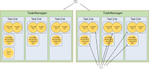

<p style="text-align:center">每个任务插槽多个线程的情况</p>


<p style="text-align:center">任务槽数量和并行度数量的关系</p>

## 并行度的设置

并行度指的是算子的并行度。

算子并行度的大小不能超过集群可用任务插槽的数量。

从上到下，优先级升高。

1. 任务管理器的配置文件里面：`flink-conf.yaml`中的配置项`parallelism.default: 1`
2. 在命令行或者WebUI提交任务时指定并行度：`./bin/flink run jar包 -p 16`
3. 全局并行度：`env.setParallelism(1)`
4. 针对算子设置并行度：`.print().setParallelism(1)`

## 并行度设置的最佳实践

1. 不要设置全局并行度，因为没办法在命令行做动态扩容。
2. 针对某些算子设置并行度，例如数据源，为了不改变数据的顺序，设置数据源的并行度为1。
3. 在命令行设置，可以动态扩容

## 任务提交流程


<p style="text-align:center">Flink任务提交流程</p>

- 在集群启动时，任务管理器会向资源管理器注册自己的任务插槽
- 任务管理器之间存在数据的交换

## Flink中的DAG数据结构


<p style="text-align:center">Flink中DAG数据结构的转换</p>

- StreamGraph：是根据用户通过Stream API编写的代码生成的最初的有向无环图。用来表示程序的拓扑结构。
- JobGraph：StreamGraph在编译的阶段经过优化后生成了JobGraph，JobGraph就是提交给作业管理器的数据结构。主要的优化为，将多个符合条件（没有shuffle，并行度相同）的算子串在一起作为一个任务链节点。保证同一个任务链节点里面的所有算子都在同一个任务插槽的同一个线程中执行。这样算子之间的数据就是本地转发（无需序列化反序列化和网络IO）两个条件：
  - 两个算子之间没有shuffle存在
  - 两个算子的并行度必须相同
- ExecutionGraph：作业管理器根据JobGraph生成ExecutionGraph。ExecutionGraph是JobGraph的并行化版本，是调度层最核心的数据结构。
- 物理执行图：Job Master线程根据ExecutionGraph对作业进行调度后，在各个任务管理器上部署Task后形成的“图”，并不是一个具体的数据结构。

我们看一下如下伪代码的DAG是如何进行转换的。

```java
source.setParallelism(1)
    .flatMap().setParallelism(2)
    .keyBy()
    .reduce().setParallelism(2)
    .sink().setParallelism(2)
```

首先生成的是StreamGraph。


<p style="text-align:center">StreamGraph</p>

StreamGraph在客户端编译时生成了JobGraph。

- source和flatMap由于并行度不同，所以无法合并成一个任务链。
- flatMap和reduce虽然并行度相同，但由于算子之间存在shuffle，所以也无法合并成一个任务链。
- reduce和sink并行度相同，且不存在shuffle，所以可以合成一个任务链。
  


<p style="text-align:center">JobGraph</p>

将JobGraph提交到作业管理器，会生成ExecutionGraph，也就是将算子按照并行度拆分成多个并行子任务。

ExecutionGraph中的每个顶点都要占用一个线程。所以下图中共有5个顶点，需要5个线程来执行。每个顶点对应了源码中的一个`Task.java`的实例。


<p style="text-align:center">ExecutionGraph</p>

JobMaster将ExecutionGraph部署到任务管理器执行。

# DataStream API

## 自定义数据源

### POJO CLASS

> 模拟Scala中的样例类

- 必须是公有类
- 所有字段必须是公有字段
- 必须有空构造器

### SourceFunction

SourceFunction\<T>的泛型是数据源中的数据的类型。

- run方法用来发送数据，由“程序启动”事件触发执行。
  - ctx.collect向下游发送数据
  - ctx.collectWithTimestamp向下游发送数据，并指定数据的事件时间
  - ctx.emitWatermark向下游发送水位线

- cancel方法在取消任务时执行，由“取消任务”事件触发执行。

> 编写Flink程序时，要注意泛型和方法的参数类型！

其他自定义数据源API
- ParallelSourceFunction\<T>：并行数据源
- RichSourceFunction\<T>：富函数版本
- RichParallelSourceFunction\<T>：并行数据源的富函数版本

## 基本转换算子

> 代表算子：flatMap

基本转换算子都是<span style="color:red">无状态算子</span>。

举个无状态函数的例子

```c
int add(int n) {
  return n + 1;
}
```
在输入相同的情况下，输出一定相同。

- MapFunction<IN, OUT>的语义：针对流或者列表中的每一个元素，输出一个元素
- FlatMapFunction<IN, OUT>的语义：针对流或者列表中的每个元素，输出0个、1个或者多个元素
- FilterFunction\<IN>的语义：针对流或者列表中的每个元素，输出0个或者1个元素

flatMap是map和filter的泛化，也就是说可以使用flatMap来实现map和filter的功能。

## 逻辑分区算子

> 代表算子：reduce

- keyBy的作用：
  - 指定数据的key。
  - 根据key计算出数据要去下游算子的哪一个并行子任务。
  - 将数据路由到下游算子的对应的并行子任务中。
- 相同key的数据一定会路由到下游算子的同一个并行子任务中。
- 不同key的数据也可能路由到下游算子的同一个并行子任务中。

> keyBy不是一个算子，因为不具备计算功能。keyBy的作用只是为数据指定key，并将数据路由到对应的并行子任务中。

reduce是<span style="color:red">有状态算子</span>。

举个有状态函数的例子。下面的函数将全局变量`count`作为内部状态维护。

```c
int count = 0;    // 初始化全局变量count
int add(int n) {
  count += n;
  return count;
}

add(1); // => 1
add(1); // => 2
add(1); // => 3
```

输入相同的情况下，输出不一定相同。

- ReduceFunction\<T>的语义：reduce算子会初始化一个空累加器（类型和流中的元素类型相同），第一条元素到来，直接作为累加器保存，并将累加器输出。第二条以及之后的元素到来，和累加器进行累加操作并更新累加器，然后将累加器输出。reduce方法定义的是输入元素和累加器的累加规则。
- 每个key都会维护自己的累加器，输入数据更新完累加器之后，直接被丢弃。
- reduce只能在keyBy之后使用。

### reduce算子如何维护逻辑分区


<p style="text-align:center">reduce算子的并行子任务如何维护逻辑分区</p>

假设我们有如下Flink代码：

```java
env
  .fromElements(1,2,3,4,5,6,7,8)
  .setParallelism(1)
  .keyBy(r -> r % 3)
  .reduce(new ReduceFunction<Integer>() {
    @Override
    public Integer reduce(Integer v1, Integer v2) throws Exception {
      return v1 + v2;
    }
  })
  .setParallelism(4)
  .print()
  .setParallelism(4);
```

那么keyBy对数据的路由方式可能是：

- 1,4,7路由到reduce的第三个并行子任务
- 3,6路由到reduce的第三个并行子任务
- 2,5,8路由到reduce的第四个并行子任务


<p style="text-align:center">keyBy可能的一种路由方式</p>

## 物理分区算子

将数据分发到不同的并行子任务。

- shuffle()：随机向下游的并行子任务发送数据。
- rebalance()：将数据轮询发送到下游的<span style="color:red">所有</span>并行子任务中。
- rescale()：将数据轮询发送到下游的<span style="color:red">部分</span>并行子任务中。用在下游算子的并行度是上游算子的并行度的整数倍的情况。
- broadcast()：将数据广播到下游的所有并行子任务中。
- global()：将数据发送到下游的第一个（索引为0）并行子任务中。
- custom()：自定义分区。可以自定义将某个key的数据发送到下游的哪一个并行子任务中去。

## 富函数

生命周期（对象的生命周期，html页面的生命周期，锁的生命周期，数据库连接的生命周期，...）

算子的每一个并行子任务都有自己的生命周期。

- open方法：在算子的计算逻辑执行前执行一次，适合做一些初始化的工作（打开一个文件，打开一个网络连接，打开一个数据库的连接）
- close方法：在算子的计算逻辑执行完毕之后执行一次，适合做一些清理工作。（关闭一个文件，关闭网络连接，关闭数据库连接）
- getRuntimeContext()方法：用来获取算子运行时的一些上下文信息。比如当前算子所处的并行子任务的索引等等。

举一些例子

- MapFunction $\rightarrow$ RichMapFunction
- FilterFunction $\rightarrow$ RichFilterFunction
- FlatMapFunction $\rightarrow$ RichFlatMapFunction
- ReduceFunction $\rightarrow$ RichReduceFunction
- SourceFunction $\rightarrow$ RichSourceFunction
- SinkFunction $\rightarrow$ RichSinkFunction

## 自定义输出

SinkFunction\<T>：泛型是要输出的数据的泛型

RichSinkFunction\<T>

# 底层API

底层API（处理函数）都是<span style="color:red">富函数</span>。

## ProcessFunction

针对没有keyBy的数据流，可以使用ProcessFunction接口，针对流中的每个元素输出0个、1个或者多个元素。（加强版RichFlatMapFunction）

- ProcessFunction<IN, OUT>：IN是输入的泛型，OUT是输出的泛型
- processElement：每来一条数据，触发一次调用。
- 使用.process(new ProcessFunction<I, O>)来调用。

## KeyedProcessFunction

针对keyBy之后的键控流（KeyedStream），可以使用KeyedProcessFunction
- KeyedProcessFunction<KEY, IN, OUT>：KEY是key的泛型，IN是输入的泛型，OUT是输出的泛型。
- processElement：来一条数据，触发调用一次。
- onTimer：定时器。时间到达某一个时间戳触发调用。
  


<p style="text-align:center">KeyedProcessFunction的并行子任务如何维护定时器</p>

- 每个key都会维护自己的定时器，每个key都只能访问自己的定时器。就好像每个key都只能访问自己的累加器一样。
- 针对每个key，在某个时间戳只能注册一个定时器，定时器不能重复注册，如果某个时间戳已经注册了定时器，那么再对这个时间戳注册定时器就不起作用了。
- .registerProcessingTimeTimer(ts)：在机器时间戳ts注册了一个定时器（onTimer）。
- 维护的内部状态
  - 状态变量
  - 定时器
- processElement方法和onTimer方法：这两个方法是<span style="color:red">原子性</span>的，无法并发执行。某个时刻只能执行一个方法。因为这两个方法都有可能操作相同的状态变量。例如：到达了一个事件，此时onTimer正在执行，则必须等待onTimer执行完以后，再调用processElement。再比如：到达了一个水位线，想触发onTimer，但此时processElement正在执行，那么必须等待processElement执行完以后再执行onTimer。
- 当水位线到达KeyedProcessFunction，如果这条水位线触发了onTimer的执行，则必须等待onTimer执行完以后，水位线才能向下游发送。
- 当水位线到达ProcessWindowFunction，如果这条水位线触发了process方法的执行，则必须等待process方法执行完以后，水位线才能向下游发送。

> 在KeyedProcessFunction中，可以认为维护了多张HashMap，每个状态变量的定义都会初始化一张HashMap，同时还有一张维护每个key的定时器队列的HashMap。

## 逻辑分区维护的状态-键控状态变量

每个key都会维护自己的状态变量

- ValueState：类似Java的普通变量一样使用。
- ListState：类似Java的ArrayList一样使用。
- MapState：类似Java的HashMap一样使用。

### ValueState-值状态变量

- 每个key都只能访问自己的状态变量，状态变量是每个key独有的。
- 状态变量是<span style="color:red">单例</span>，只能被初始化一次。
- 状态变量会每隔一段时间作为检查点保存到状态后端（例如HDFS）。
- 当Flink程序启动时，会先去状态后端（例如HDFS）寻找状态变量，如果找不到，则初始化。如果找到了，则直接读取。符合单例特性。为什么Flink程序启动的时候，先去状态后端寻找状态变量呢？因为Flink不知道程序是第一次启动，还是故障恢复后的启动。如果是故障恢复，则要去保存的检查点里寻找状态变量，恢复到最近一次检查点的状态。
- .getState方法通过状态描述符去状态后端寻找状态变量
- 读取值状态变量中的值：.value()方法
- 将值写入状态变量：.update()方法
- 如何清空状态变量：.clear()方法


<p style="text-align:center">KeyedProcessFunction的并行子任务如何维护ValueState</p>

### ListState-列表状态变量

- .get()方法：返回包含列表状态变量中所有元素的迭代器
- .clear()方法：清空状态变量
- .add()方法：添加元素
  


<p style="text-align:center">KeyedProcessFunction的并行子任务如何维护ListState</p>

### MapState-字典状态变量

- .put(KEY, VALUE)方法：添加KEY $\rightarrow$ VALUE键值对
- .get(KEY)方法：获取KEY的VALUE
- .contains(KEY)方法：检测KEY是否存在
- .keys()：返回所有KEY组成的集合
  


<p style="text-align:center">KeyedProcessFunction的并行子任务如何维护MapState</p>

## 窗口API

### ProcessWindowFunction

使用在`stream.keyBy().window()`之后的流

- ProcessWindowFunction<IN, OUT, KEY, WINDOW>
- process方法：窗口闭合的时候触发调用
- Flink中的窗口是左闭右开：[0,10)，当时间到达9999ms的时候，触发process函数的调用。
- 窗口从1970-01-01 00:00:00开始对齐
- 滚动窗口的计算公式，开了一个5秒钟的滚动窗口，7秒钟到达的事件属于哪个窗口？
- 窗口开始时间 = 时间戳 - 时间戳 % 窗口大小
  - windowStartTime = 1234ms - 1234 % 5000 = 0ms
  - windowStartTime = 7000ms - 7000 % 5000 = 5000ms

- 属于某个窗口的第一条数据到达以后才会开窗口
- 窗口内部状态：
  - 属于窗口的所有事件
  - 定时器：时间戳=窗口结束时间 - 1毫秒（因为是左闭右开区间），方法是process函数

> 在只使用ProcessWindowFunction的情况下，process方法的迭代器参数包含了属于窗口的所有数据，会对内存造成压力，那么应该怎么去优化呢？使用累加器的思想。

### AggregateFunction

增量聚合函数，关键思想是在每个窗口中维护一个累加器。

- AggregateFunction<IN, ACC, OUT>
- createAccumulator：创建空累加器，返回值的泛型是累加器的泛型
- add：定义输入数据和累加器的聚合规则，返回值是聚合后的累加器
- getResult：窗口闭合时发出聚合结果，返回值是将要发送的聚合结果
- merge：一般不需要实现。只用在<span style="color:red">事件时间会话窗口</span>的情况。

### 将AggregateFunction和ProcessWindowFunction结合使用

当窗口闭合时：AggregateFunction将getResult()方法的返回值，发送给了ProcessWindowFunction。


<p style="text-align:center">AggregateFunction将getResult的结果发送给ProcessWindowFunction</p>

ProcessWindowFunction的process方法的迭代器参数中只有一个元素。

### 窗口的底层实现

**AggregateFunction和ProcessWindowFunction结合使用的底层实现**


<p style="text-align:center">AggregateFunction和ProcessWindowFunction结合使用</p>

**只使用ProcessWindowFunction的底层实现**


<p style="text-align:center">只使用ProcessWindowFunction</p>

窗口中的所有元素都保存在List中。

### ProcessAllWindowFunction

```java
stream
  .windowAll()
  .process(new ProcessAllWindowFunction())
```

直接对流进行开窗口，等价于将所有数据keyBy到同一条流，然后进行开窗口。

```java
stream
  .keyBy(r -> 1)
  .window()
  .process(new ProcessWindowFunction())
```

### 触发器

> 窗口大小是1天，但想每隔10秒钟计算一次窗口中的统计指标，怎么办？

```java
stream
  .keyBy()
  .window()
  .trigger()
  .process()/aggregate()
```

触发器触发的是trigger后面的process/aggregate方法。

Trigger<T, W>：T是窗口中的元素类型，W是窗口类型。

TriggerResult

- CONTINUE：什么都不做
- FIRE：触发窗口的计算
- PURGE：清空窗口中的元素
- FIRE_AND_PURGE：触发窗口计算并清空窗口中的元素

Trigger中的核心方法

- onElement：每来一条数据调用一次
- onProcessingTime：处理时间定时器
- onEventTime：事件时间定时器
- clear：窗口闭合时触发调用

# 窗口

## 窗口概念

- 一般真实的流都是无界的，怎样处理无界的数据？
- 可以把无限的数据流进行切分，得到有限的数据集进行处理—也就是得到有界流
- 窗口（Window）就是将无限流切割为有限流的一种方式，它会将流数据分发到有限大小的桶（bucket）中进行分析

## 窗口的本质

我们一般在.keyBy之后使用.window方法来进行开窗，实际上是在keyBy之后的逻辑分区中，再按照窗口进行一次逻辑分区。先分流再开窗。

```sql
SELECT * FROM table GROUP BY key, window;
```

Flink窗口是左闭右开的区间，例如[0, 5)的窗口最后一个时间戳是4999毫秒。

## 窗口类型

- 时间窗口（Time Window）
  - 滚动时间窗口
  - 滑动时间窗口
  - 会话窗口
- 计数窗口（Count Window）
  - 滚动计数窗口
  - 滑动计数窗口

## 滚动窗口

- 将数据依据固定的窗口长度对数据进行切分
- 时间对齐，窗口长度固定，没有重叠
  


<p style="text-align:center">滚动窗口</p>

## 滑动窗口


<p style="text-align:center">滑动窗口</p>

- 滑动窗口是固定窗口的更广义的一种形式，滑动窗口由固定的窗口长度和滑动间隔组成
- 窗口长度固定，可以有重叠
- 如果一个元素同时属于两个窗口，那么会将元素复制两份，每个窗口分配一个元素。这样就可以保证所有的窗口从逻辑上分开处理。

```js
{
    "Mary": MapState {
        (0,10): [...,Event(7s)],
        (5,15): [...,Event(7s)],
        (10,20): [...],
        ...
        ...
    },
    "Bob": MapState {
        (0,10): [...,Event(7s)],
        (5,15): [...,Event(7s)],
        (10,20): [...],
        ...
        ...
    },
}
```

## 会话窗口

- 会话窗口的长度是<span style="color:red">不固定</span>的。
- 使用超时时间来定义会话窗口。
- 会话窗口开始时间：窗口中第一个元素的时间戳
- 会话窗口结束时间：窗口中最后一个元素的时间戳+超时时间


<p style="text-align:center">会话窗口</p>

# 逻辑时钟-水位线

两种时间语义


<p style="text-align:center">两种时间语义</p>

- 处理时间：事件进入process算子的机器时间。调用`ctx.timerService().currentProcessingTime()`时的机器时间。
- 事件时间：事件中包含的时间戳，事件真实发生的时间。

举两个例子：


<p style="text-align:center">星球大战</p>


<p style="text-align:center">打游戏</p>

<span style="color:red">由于事件时间的世界里面没有时钟</span>，所以我们需要为事件时间的世界提供时钟，叫做水位线（逻辑时钟）。

时钟的定义：单调递增的序列。

如果单调递增的序列是CPU产生的，那么就是物理时钟。如果是编程产生的，那么就是逻辑时钟。

水位线流动到哪一个算子，哪一个算子就会更新自己的时钟（产线工人的手表）。水位线不会弯道超车，也就是说，水位线不会绕过水位线前面的数据传播下去。如果某个算子的计算过程很耗时，那么会阻塞水位线的向下传播。如果上游的算子阻塞了水位线的传播，那么上游算子和下游算子的水位线（时钟）可能是不一样的。

在使用处理时间（ProcessingTime）的情况下，不存在乱序数据的情况。

乱序数据只存在于使用事件时间的情况下。

时钟：
- 物理时钟：机器时间，墙上时钟
- 逻辑时钟：水位线
在Flink里面，时钟的作用是什么？
- 触发定时器
- 关闭窗口

## 有关水位线的一些约定

1. 水位线是事件时间的世界中的逻辑时钟。
2. Flink认为携带时间戳 $\le$ 水位线的事件都已经到达。
3. 水位线是一种<span style="color:red">特殊的事件</span>。由程序员编程（调用`assignTimestampsAndWatermarks`）插入到数据流中。随数据流流动。
4. 算子的每个并行子任务会维护自己的水位线（逻辑时钟），当接收到上游发送过来的水位线时，更新自己的逻辑时钟。
5. 水位线 = 观察到的最大事件时间戳 - 最大延迟时间 - 1 毫秒
   - 最大延迟时间需要程序员根据经验自己设置

6. Flink会在流的最开始插入一个时间戳为负无穷大的水位线
7. Flink会在流的最末尾插入一个时间戳为正无穷大的水位线
8. 水位线 $\ge$ 窗口结束时间，触发窗口计算。
9. 水位线 $\ge$ 定时器时间戳，触发定时器执行。

## 多流转换时水位线的传播机制


<p style="text-align:center">多流转换水位线传播机制</p>

- 分流：水位线复制然后广播到下游的所有并行子任务中去。
- 合流：
  - 第一步：到达的水位线覆盖数组中对应的水位线。
  - 第二步：选择水位线数组中的最小的水位线来更新并行子任务的逻辑时钟。


## 水位线设置的最佳实践

- 在尽量靠近数据源的地方插入水位线（assignTimestampsAndWatermarks）
- assignTimestampsAndWatermarks前面的算子的并行度最好是1

## Kafka水位线设置

数据源的并行度等于Kafka主题的分区数量。

插入水位线之前的所有算子的并行度和Kafka主题的分区数量一致。

## 如何处理迟到数据

到达的数据的时间戳小于当前算子的水位线，就是迟到数据。<span style="color:red">只有在使用事件时间的情况下，才会存在迟到元素</span>。对于处理时间来说，不存在迟到数据。

处理迟到数据的策略：

- 默认策略
  - 如果来的数据是迟到数据，但是所属窗口还在，那么数据可以进入窗口。
  - 如果来的数据是迟到数据，但所属窗口已经销毁，那么数据被丢弃。
- 将迟到数据发送到侧输出流中去。侧输出流是不同于主流输出的旁路输出流，可以向侧输出流发送任意数据。
  - `new OutputTag<T>("output-tag"){}`：单例

- 使用迟到元素更新窗口计算结果。也就是当水位线到达窗口结束时间的时候，触发窗口计算，但不销毁窗口，而是选择再等待迟到元素一段时间。
  - .allowedLateness(Time.seconds(5))：窗口会等待5秒钟的迟到事件
  - 窗口真正销毁：水位线 $\ge$ 窗口结束时间 + allowedLateness
  - 窗口的第一次触发计算：水位线 $\ge$ 窗口结束时间，触发计算完以后窗口不会被销毁

**处理迟到数据的作用**：将迟到数据保存下来，然后统计一下每天有多少迟到数据，然后方便我们调整最大延迟时间的设置，改进计算结果的正确性。

# 多流合并

Flink的多流合并的机制是以<span style="color:red">FIFO</span>的方式合并多条流。

- union
  - 多条流的元素类型必须一样
  - 可以合并多条流：`stream1.union(stream2, stream3)`
- connect
  - 只能合并两条流
  - 两条流的元素的类型可以不一样
  - DataStream API
    - CoMapFunction<IN1, IN2, OUT>
      - map1
      - map2
    - CoFlatMapFunction<IN1, IN2, OUT>
      - flatMap1：来自第一条流的事件进入CoFlatMapFunction，触发调用。
      - flatMap2：来自第二条流的事件进入CoFlatMapFunction，触发调用。
  - 底层API
    - CoProcessFunction<IN1, IN2, OUT>
      - processElement1
      - processElement2
      - onTimer
      - 状态变量
  - 应用场景
    - 一条流进行keyBy，另一条流broadcast，使的所有的逻辑分区都能和同一条流进行JOIN。
    - 两条流都进行keyBy，将来自两条流的相同key的数据合并在一起处理，也就是说，将来自两条流的相同key的数据放在一个逻辑分区中做处理。

```sql            
SELECT * FROM A JOIN B ON A.key=B.key;
```

# Flink中的状态变量

- 算子状态（Operator State）
  - 算子状态的作用范围限定为算子的并行子任务，由同一并行子任务所处理的所有数据都可以访问到相同的状态。
  - 算子状态对于同一并行子任务而言是共享的。
  - 算子状态不能由相同或不同算子的另一个并行子任务访问。
- 键控状态（Keyed State）
  - 键控状态是根据输入数据流中定义的key来维护和访问的。
  - Flink为每个key维护一个状态实例，并将具有相同key的所有数据，都分区到算子的同一个并行子任务中，这个任务会维护和处理这个key对应的状态。
  - 当任务处理一条数据时，它会自动将状态的访问范围限定为当前数据的key。
  - 键控状态的底层维护方式是在并行子任务中维护一张HashMap。
- 窗口状态（Windowed State）：作用域是每个窗口。


<p style="text-align:center">各种状态变量的作用域示意图</p>

## Flink中的状态管理

### 状态后端

- 每传入一条数据，有状态的算子任务都会读取和更新状态
- 由于有效的状态访问对于处理数据的低延迟至关重要，因此每个并行子任务都会在本地（JVM的堆内存）维护其状态，以确保快速的状态访问
- 状态的存储、访问以及维护，由一个可插入的组件决定，这个组件就叫做状态后端（state backend）
- 状态后端主要负责两件事
  - 本地的状态管理
  - 将状态写入远程存储（HDFS、RocksDB、文件系统之类的）的检查点文件中。


### 选择一个状态后端

- MemoryStateBackend（默认）
  - 内存级的状态后端，会将状态作为内存中的对象进行管理，将本地状态存储在任务管理器的JVM堆上，而将检查点文件存储在作业管理器的内存中。
  - 特点：快速、低延迟，但不稳定
- FsStateBackend（最常用）
  - 将状态存到远程的持久化文件系统（FileSystem）上面的检查点文件里面，而对于本地状态，跟MemoryStateBackend一样，也会存在任务管理器的JVM堆上。
  - 同时拥有内存级的本地访问速度，和更好的容错保证
- RocksDBStateBackend
  - 在任务管理器的JVM堆中，维护本地状态。将所有状态序列化后，存入RocksDB中。
  - RocksDB是一个硬盘KV数据库。
    
# Flink的容错机制

## Flink程序如何从检查点恢复程序


<p style="text-align:center">快照</p>

- Flink故障恢复机制的核心，就是应用状态的一致性检查点。
- 有状态流应用的一致检查点，其实就是所有并行子任务的状态，在某个时间点的一份拷贝（一份快照）。
- 上游是一个可重置读取位置的持久化设备（例如Kafka）。
  


<p style="text-align:center">故障</p>


<p style="text-align:center">第一步：重启</p>


<p style="text-align:center">第二步：从检查点文件恢复状态</p>


<p style="text-align:center">第三步：继续处理数据</p>

无论重启多少次程序，某个数值只会在累加器中被累加一次，这个就叫做<span style="color:red">精准一次消费（Exactly-Once）</span>——既不会丢失数据，也不会重复累加某个数据。

## Flink如何保存检查点

**保存检查点的算法**

- 同步的思想
  - 暂停应用，保存状态到检查点，再重新恢复应用（Spark Streaming）

- 异步的思想（Flink的改进实现）
  - 基于Chandy-Lamport算法的异步分布式快照算法
  - 将检查点的保存和数据处理分离开，不暂停整个应用


**算法的核心机制：检查点分界线**

> 检查点分界线：checkpoint barrier

- 检查点分界线是一种<span style="color:red">特殊的事件</span>。用来把一条流上的数据按照不同的检查点分开。
- 检查点分界线之前到来的数据导致的状态更改，都会被包含在当前检查点分界线所属的检查点中；而基于检查点分界线之后的数据导致的所有更改，就会被包含在之后的检查点中。
- 检查点分界线到达哪一个并行子任务，就对哪一个并行子任务的状态做快照。

> Flink中有两种特殊的事件：
>
> - 水位线
> - 检查点分界线


<p style="text-align:center">示例程序</p>


<p style="text-align:center">启动检查点</p>

作业管理器会向每个Source的并行子任务发送一条带有新检查点ID的消息，通过这种方式来启动检查点的保存工作。


<p style="text-align:center">向下游发送检查点分界线</p>

在分流时，检查点分界线是广播出去的。和水位线在分流时的传递机制相同。


<p style="text-align:center">分界线对齐</p>

- 分界线对齐：检查点分界线向下游传递，sum任务会等待所有输入分区的检查点分界线到达
- 对于检查点分界线已经到达的分区，继续到达的数据会被缓存
- 而检查点分界线尚未到达的分区，数据会被正常处理

sum_even什么时候做快照？必须接收到来自source1和source2的所有检查点分界线时，才会做快照。这个机制叫做<span style="color:red">检查点分界线对齐</span>。检查点分界线在合流时的传递机制和水位线不一样。


<p style="text-align:center">继续向下游发送检查点分界线</p>

Source并行子任务将它们的状态写入检查点文件，并发出一个检查点分界线。

状态后端在状态存入检查点文件之后，会返回通知给Source的并行子任务，Source的并行子任务就会向作业管理器确认Source的并行子任务的检查点保存完成。


<p style="text-align:center">任务正常处理数据</p>


<p style="text-align:center">检查点保存完成</p>


# 端到端一致性

## 状态一致性分类

- AT-MOST-ONCE（最多一次）
  - 当任务故障时，最简单的做法是什么都不干，既不恢复丢失的状态，也不重播丢失的数据。at-most-once语义的含义是最多处理一次事件。例如：UDP，不提供任何一致性保障
- AT-LEAST-ONCE（至少一次）
  - 在大多数的真实应用场景，我们希望不丢失事件。这种类型的保障称为at-least-once，意思是所有的事件都得到了处理，而一些事件还可能被处理多次。
- EXACTLY-ONCE（精确一次）
  - 恰好处理一次是最严格的保证，也是最难实现的。恰好处理一次语义不仅仅意味着没有事件丢失，还意味着针对每一个数据，内部状态仅仅更新一次。
  
## 端到端状态一致性

- 目前我们看到的一致性保证都是由流处理器实现的，也就是说都是在Flink流处理器内部保证的；而在真实应用中，流处理应用除了流处理器以外还包含了数据源（例如Kafka）和输出到持久化系统
- 端到端的一致性保证，意味着结果的正确性贯穿了整个流处理应用的始终；每一个组件都保证了它自己的一致性
- 整个端到端的一致性级别取决于所有组件中一致性最弱的组件
## 端到端EXACTLY-ONCE一致性保障

- 内部保证—checkpoint（分布式异步快照算法）
- Source端—可重设数据的读取位置（Kafka，FileSystem）
- Sink端—从故障恢复时，数据不会重复写入外部系统
  - 幂等写入
  - 事务写入
  
## 幂等写入

所谓幂等操作，是说一个操作，可以重复执行很多次，但只导致一次结果更改，也就是说，后面再重复执行就不起作用了。

## 事务写入

- 事务（Transaction）  
  - 应用程序中一系列严密的操作，所有操作必须成功完成，否则在每个操作中所作的所有更改都会被撤消（ACID）
  - 具有原子性：一个事务中的一系列的操作要么全部成功，要么一个都不做
- 实现思想：构建的事务对应着检查点，等到检查点保存真正完成的时候，才把所有要输出的结果写入Sink系统中。
- 实现方式
  - 预写日志（WAL，Write Ahead Log）（只能保证at-least-once）
  - 两阶段提交（Two Phase Commit，2PC）（可以保证exactly-once）

## 预写式日志

- 把结果数据（也就是要输出的数据）先缓存到状态后端，然后在收到检查点完成的通知时，一次性写入Sink系统（状态后端 $\rightarrow$ 下游设备）（万一写到中间的时候挂掉了呢？WAL只能保障at-least-once）
- 简单易于实现，由于数据提前在状态后端中做了存储，所以无论什么样的下游设备，都能用这种方式一批搞定
- DataStream API提供了一个模板类：GenericWriteAheadSink，来实现这种预写式日志的Sink。

## 两阶段提交

- 对于每个检查点，Sink任务会启动一个事务（下游设备的事务，比如MySQL，Kakfa），并将接下来所有接收的数据添加到事务里
- 然后将这些要输出的数据写入外部Sink系统的事务中，但不正式提交它们——这时只是“预提交”
- 当Sink算子接收到检查点完成（所有的并行子任务都完成了快照的保存操作）的通知时，它才正式提交下游设备的事务，实现结果的真正写入
  - 这种方式真正实现了Exactly-Once，它需要一个提供事务支持的外部Sink系统。Flink提供了TwoPhaseCommitSinkFunction接口。
  - 有可能在一段时间内看不到Sink的结果
  
## 总结

|                                           | 不可重置的源 | 可重置的源    |
| ----------------------------------------- | ------------ | ------------- |
| any sink                                  | at-most-once | at-least-once |
| <span style="color:red">幂等性sink</span> | at-most-once | exactly-once  |
| 预写式日志sink                            | at-most-once | at-least-once |
| <span style="color:red">两阶段提交</span> | at-most-once | exactly-once  |

## Kafka $\rightarrow$ Flink $\rightarrow$ Kafka端到端一致性

- 内部—利用检查点机制，把状态存盘（HDFS），发生故障的时候可以恢复，保证内部的状态一致性。
- source—FlinkKafkaConsumer作为source，可以将偏移量保存下来，如果后续任务出现了故障，恢复的时候可以由连接器重置偏移量，重新消费数据，保证一致性。
- sink—FlinkKafkaProducer作为sink。

### 两阶段提交步骤

1. 第一条数据来了之后，开启一个Kafka的事务（transaction），正常写入Kafka分区日志但标记为未提交，这就是“预提交”
2. JobManager触发checkpoint操作，barrier从source开始向下传递，遇到barrier的算子将状态存入状态后端，并通知JobManager
3. Sink连接器收到barrier，保存当前状态，存入checkpoint，通知JobManager，并开启下一阶段的事务，用于提交下个检查点的数据
4. JobManager收到所有任务的通知，发出确认信息，表示checkpoint完成
5. Sink任务收到JobManager的确认信息，正式提交这段时间的数据
6. 外部Kafka关闭事务，提交的数据可以正常消费了

# 背压问题

背压问题的本质：单位时间缓冲区入队列的数据量，大于缓冲区出队列的数据量。

- 减慢入队列（生产者）的速度
- 加快出队列（消费者）的速度
- 增大缓冲区队列的大小
- 消费者告诉生产者自己目前能消费多少（信用度）

下游算子会向上有算子发送一个消息，告诉上游算子自己的接收缓冲区能接收多少数据，当上游算子的缓冲区攒够 $\le$ 下游算子的接收缓冲区能接收的数据量，就发送下去。

例如：

下游算子的接收缓冲区的大小是4，但目前只有3个元素，也就是说还能接收1个元素，那么会发送一条消息给上游算子，告诉上游算子自己的缓冲区还有1个空位，这样当上游算子的发送缓冲区里有1条数据，直接发送给下游算子的接收缓冲区。

**信用度算法**

信用度：下游算子的接收缓冲区还能接收多少条数据。

**基于信用度的流量控制**

通过网络连接来发送每条数据的效率很低，会导致很大的开销。为了充分利用网络连接的带宽，就需要进行缓冲了。在流处理的上下文中，缓冲的一个缺点是会增加延迟，因为数据需要在缓冲区中进行收集，而不是立即发送。

Flink实现了一个基于信用度的流量控制机制，其工作原理如下。接收任务授予发送任务一些“信用度”（credit），也就是为了接收其数据而保留的网络缓冲区数。当发送者收到一个信用度通知，它就会按照被授予的信用度，发送尽可能多的缓冲数据，并且同时发送目前积压数据的大小——也就是已填满并准备发送的网络缓冲的数量。接收者用保留的缓冲区处理发来的数据，并对发送者传来的积压量进行综合考量，为其所有连接的发送者确定下一个信用度授权的优先级。

基于信用度的流控制可以减少延迟，因为发送者可以在接收者有足够的资源接受数据时立即发送数据。此外，在数据倾斜的情况下，这样分配网络资源是一种很有效的机制，因为信用度是根据发送者积压数据量的规模授予的。因此，基于信用的流量控制是Flink实现高吞吐量和低延迟的重要组成部分。

# 有限状态机


<p style="text-align:center">判断字符串中的0是否为偶数个</p>

flink cep官网链接

https://nightlies.apache.org/flink/flink-docs-master/zh/docs/libs/cep/
