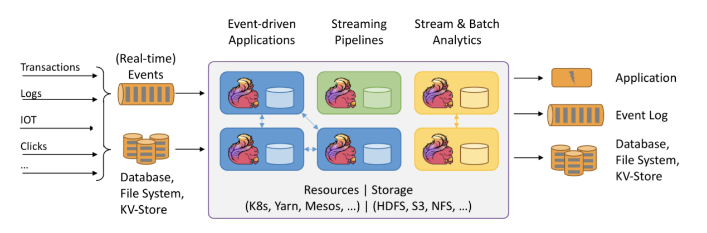
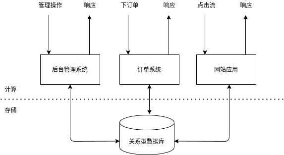
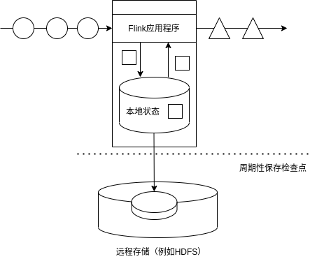

= Flink教程
:icons: font
:source-highlighter: highlightjs
:toc: left
:toclevels: 4
:sectnums:
:stem: latexmath
:figure-caption!:

== 初识Flink

Flink是Apache基金会旗下的一个开源大数据处理框架。目前，Flink已经成为各大公司大数据实时处理的发力重点，特别是国内以阿里为代表的一众大厂都在全力投入，为Flink社区贡献了大量源码。如今Flink已被很多人认为是大数据实时处理的方向和未来，许多公司也都在招聘和储备掌握Flink的人才。

那Flink到底是什么，又有什么样的优点，能够让大家对它如此青睐呢？

本章我们就来做一个详细的了解。首先讲述Flink的源起和设计理念，接着介绍Flink如今的应用领域；进而通过梳理数据处理架构的发展演变，解答为什么要用Flink的疑问。进而梳理Flink的特点，并同另一个流行的大数据处理框架Spark进行比较，从而更深刻地理解Flink的底层架构和优势所在。

=== Flink的源起和设计理念

Flink起源于一个叫做Stratosphere的项目，它是由3所地处柏林的大学和欧洲其他一些大学在2010~2014年共同进行的研究项目，由柏林理工大学的教授沃克尔·马尔科（Volker Markl）领衔开发。2014年4月，Stratosphere的代码被复制并捐赠给了Apache软件基金会，在此基础上重新设计出了Flink。

在德语中，“flink”一词表示“快速、灵巧”。项目的logo是一只彩色的松鼠，当然了，这不仅是因为Apache大数据项目对动物的喜好（是否联想到了Hadoop、Hive？），更是因为松鼠这种小动物完美地体现了“快速、灵巧”的特点。关于logo的颜色，还一个有趣的缘由：柏林当地的松鼠非常漂亮，颜色是迷人的红棕色；而Apache软件基金会的logo，刚好也是一根红棕色为主的渐变色羽毛。于是，Flink的松鼠logo就设计成了红棕色，而且拥有一个漂亮的渐变色尾巴，尾巴的配色与Apache软件基金会的logo一致。这只松鼠色彩炫目，既呼应了Apache的风格，似乎也预示着Flink未来将要大放异彩。Flink Logo如图1-1所示。

.图1-1 Flink Logo

从命名上，我们也可以看出Flink项目对于自身特点的定位，那就是对于大数据处理，要做到快速和灵活。

* 2014年8月，Flink第一个版本0.6正式发布（至于0.5之前的版本，那就是在Stratosphere名下的了）。与此同时Fink的几位核心开发者创办了Data Artisans 公司，主要做Fink的商业应用，帮助企业部署大规模数据处理解决方案。
* 2014年12月，Flink项目完成了孵化，一跃成为Apache软件基金会的顶级项目。
* 2015年4月，Flink发布了里程碑式的重要版本0.9.0，很多国内外大公司也正是从这时开始关注、并参与到Flink社区建设的。
* 2019年1月，对Flink长期投入研发的阿里巴巴，以9000万欧元的价格收购了Data Artisans 公司；之后又将自己的内部版本Blink开源，继而合并入了8月份发布的Flink 1.9.0版本。自此之后，Flink被越来越多的人所熟知，成为了当前最火的新一代大数据处理框架。

可以看到，Flink从真正起步到火爆，只不过几年时间。在这短短几年内，Flink从最初的第一个稳定版本0.9，到目前本书编写期间已经发布到了1.13.0，这期间不断有新功能新特性加入。从一开始，Flink就拥有一个非常活跃的社区，而且一直在快速增长。到目前为止，Flink的代码贡献者（Contributors）已有超过800人，并且它已经发展成为最复杂的开源流处理引擎之一，得到了广泛的应用。 

根据Apache 软件基金会发布的2020 年度报告，Flink项目的社区参与和贡献依旧非常活跃，在Apache旗下的众多项目中保持着多项领先：

* 邮件列表（Mailing List）活跃度，排名第一
* 代码提交（Commits）数，排名第二
* GitHub 访问量，排名第二

Flink就像一列高速行进的列车，向我们呼啸而来，朝着未来更实时、更稳定的大数据处理奔去。这辆通向未来的车，我们上车可以迟，但一定不要错过。

我们需要记住Flink的官网主页地址：https://flink.apache.org/

在Flink官网主页的顶部可以看到，项目的核心目标，是“数据流上的有状态计算”（Stateful Computations over Data Streams）。

具体定位是：Apache Flink是一个框架和分布式处理引擎，如图1-2所示，用于对无界和有界数据流进行有状态计算。Flink被设计在所有常见的集群环境中运行，以内存执行速度和任意规模来执行计算。

.图1-2 Flink 框架处理流程

这里有很多专业词汇，我们从中至少可以提炼出一些容易理解的信息：Flink是一个“框架”，是一个数据处理的“引擎”；既然是“分布式”，当然是为了应付大规模数据的应用场景了；另外，Flink处理的是数据流。所以，Flink是一个流式大数据处理引擎。

而“内存执行速度”和“任意规模”，很明显突出了Flink的两个特点：速度快、可扩展性强——这说的自然就是小松鼠的“快速”和“灵巧”了。

那什么叫做“无界和有界数据流”，什么又叫做“有状态计算”呢？这设计到流处理的相关知识，我们会在后续的章节一一展开。

=== Flink的应用

Flink是一个大数据流处理引擎，它可以为不同的行业提供大数据实时处理的解决方案。随着Flink的快速发展完善，如今在世界范围许多公司都可以见到Flink的身影。

Flink目前在全球的热度很高，北美、欧洲和金砖四国均是Flink的应用热门区域。当然，这些地区其实也就是IT、互联网行业较发达的地区。

Flink在国内热度尤其高，一方面是因为阿里的贡献和带头效应，另一方面也跟中国的应用场景密切相关。中国的人口规模与互联网使用普及程度，决定了对大数据处理的速度要求越来越高，也倒逼着中国的互联网企业去追逐更高的数据处理效率。试想在中国，一个网站可能要面对数亿的日活用户、每秒数亿次的计算峰值，这对很多国外的公司是无法想象的。而Flink恰好给我们高速准确的处理海量流式数据提供了可能。

==== Flink在企业中的应用

Flink为全球许多公司和企业的关键业务应用提供了强大的支持。

对于数据处理而言，任何行业、任何公司的需求其实都是一样的：数据规模大、实时性要求高、保证结果准确、方便扩展、故障后可恢复——而所有这些要求，作为新一代大数据流式处理引擎的Flink统统可以满足！这也正是Flink得到全世界范围广泛应用的原因。

Flink官网列出了很多知名企业用户，他们在生产环境中有各种各样有趣的应用。

以大家熟悉的阿里为例。阿里巴巴这个庞大的电商公司，为买方和卖方提供了交易平台。它的个性化搜索和实时推荐功能就是通过Blink 实现的（当然我们知道，Blink就是基于Flink的，现在两者也已合体）。用户所购买或者浏览的商品，可以被用作推荐的依据，这就是为什么我们经常发现“刚看过什么、网站就推出来了”。当用户数据量非常庞大时，快速的分析响应、实时做出精准的推荐就显得尤为困难。而 Flink 这样真正意义上的大数据流处理引擎，就能做到这些。这也是阿里在Flink上充分发力并成为引领者的原因。

==== Flink主要的应用场景

我们看到，各种行业的众多公司都在使用Flink，那到底他们用Flink来处理什么需求呢？换句话说，什么的场景最适合Flink大显身手呢？

回到Flink本身的定位，它是一个大数据流式处理引擎，处理的是流式数据，也就是“数据流”（Data Flow）。顾名思义，数据流的含义是，数据并不是收集好的，而是像水流一样，是一组有序的数据序列，逐个到来、逐个处理。由于数据来到之后就会被即刻处理，所以流处理的一大特点就是“快速”，也就是良好的实时性。Flink适合的场景，其实也就是需要实时处理数据流的场景。

具体来看，一些行业中的典型应用有：

* 电商和市场营销

举例：实时数据报表、广告投放、实时推荐

在电商行业中，网站点击量是统计PV、UV的重要来源，也是如今“流量经济”的最主要数据指标。很多公司的营销策略，比如广告的投放，也是基于点击量来决定的。另外，在网站上提供给用户的实时推荐，往往也是基于当前用户的点击行为做出的。

网站获得的点击数据可能是连续且不均匀的，还可能在同一时间大量产生，这是典型的数据流。如果我们希望把它们全部收集起来，再去分析处理，就会面临很多问题：首先，我们需要很大的空间来存储数据；其次，收集数据的过程耗去了大量时间，统计分析结果的实时性就大大降低了；另外，分布式处理无法保证数据的顺序，如果我们只以数据进入系统的时间为准，可能导致最终结果计算错误。

我们需要的是直接处理数据流，当然，Flink就可以做到这一点。

* 物联网（IOT）

举例：传感器实时数据采集和显示、实时报警，交通运输业

物联网是流数据被普遍应用的领域。各种传感器不停获得测量数据，并将它们以流的形式传输至数据中心。而数据中心会将数据处理分析之后，得到运行状态或者报警信息，实时地显示在监控屏幕上。所以在物联网中，低延迟的数据传输和处理，以及准确的数据分析通常很关键。

交通运输业也体现了流处理的重要性。比如说，如今高铁运行主要就是依靠传感器检测数据，测量数据包括列车的速度和位置，以及轨道周边的状况。这些数据会从轨道传给列车，再从列车传到沿途的其它传感器；与此同时，数据报告也被发送回控制中心。因为列车处于高速行驶状态，因此数据处理的实时性要求是极高的。如果流数据没有被及时正确处理，调整意见和警告就不能相应产生，后果可能会非常严重。

* 物流配送和服务业

举例：订单状态实时更新、通知信息推送

在很多服务型应用中，都会涉及到订单状态的更新和通知的推送。这些信息基于事件触发，不均匀地连续不断生成，处理之后需要及时传递给用户。这也是非常典型的数据流的处理。

* 银行和金融业

举例：实时结算和通知推送，实时检测异常行为

银行和金融业是另一个典型的应用行业。用户的交易行为是连续大量发生的，银行面对的是海量的流式数据。由于要处理的交易数据量太大，以前的银行是按天结算的，汇款一般都要隔天才能到账。所以有一个说法叫作“银行家工作时间”，说的就是银行家不仅不需要996，甚至下午早早就下班了：因为银行需要早点关门进行结算，这样才能保证第二天营业之前算出准确的账。这显然不能满足我们快速交易的需求。在全球化经济中，能够提供24小时服务变得越来越重要。现在交易和报表都会快速准确地生成，我们跨行转账也可以做到瞬间到账，还可以接到实时的推送通知。这就需要我们能够实时处理数据流。

另外，信用卡欺诈的检测也需要及时的监控和报警。一些金融交易市场，对异常交易行为的及时检测可以更好地进行风险控制；还可以对异常登录进行检测，从而发现钓鱼式攻击，从而避免巨大的损失。

=== 流式数据处理的发展和演变

我们已经了解，Flink的主要应用场景，就是处理大规模的数据流。那为什么一定要用Flink呢？数据处理还有没有其它的方式？要解答这个疑惑，我们就需要先从流处理和批处理的概念讲起。

==== 流处理和批处理

数据处理有不同的方式。

对于具体应用来说，有些场景数据是一个一个来的，是一组有序的数据序列，我们把它叫做“数据流”；而有些场景的数据，本身就是一批同时到来，是一个有限的数据集，这就是批量数据（有时也直接叫数据集）。

容易想到，处理数据流，当然应该“来一个就处理一个”，这种数据处理模式就叫做流处理；因为这种处理是即时的，所以也叫实时处理。与之对应，处理批量数据自然就应该一批读入、一起计算，这种方式就叫做批处理，也叫做离线处理。

那真实的应用场景中，到底是数据流更常见、还是批量数据更常见呢？

生活中，这两种形式的数据都有，如图1-3所示。比如我们日常发信息，可以一句一句地说，也可以写一大段一起发过去。一句一句的信息，就是一个一个的数据，它们构成的序列就是一个数据流；而一大段信息，是一组数据的集合，对应就是批量数据（数据集）。

.图1-3 Flink处理的两种数据形式

当然，有经验的人都会知道，一句一句地发，你一言我一语，有来有往这才叫聊天；一大段信息直接砸过去，别人看着都眼晕，很容易就没下文了——如果是很重要的整篇内容（比如表白信），写成文档或者邮件发过去可能效果会更好。

所以我们看到，“聊天”这个生活场景，数据的生成、传递和接收处理，都是流式的；而“写信”的场景，数据的生成尽管应该也是流式的（字总得一个个写），但我们可以把它们收集起来，统一传输、统一处理（当然我们还可以进一步较真：处理也是流式的，字得一个一个读）。不论传输处理的方式是怎样的，数据的生成，一般都是流式的。

在IT应用场景中，这一点会体现的更加明显。企业的绝大多数应用程序，都是在不停地接收用户请求、记录用户行为和系统日志，或者持续接收采集到的状态信息。所以数据会在不同的时间持续生成，形成一个有序的数据序列——这就是典型的数据流。

所以流数据更真实地反映了我们的生活方式。真实场景中产生的，一般都是数据流。那处理数据流，就一定要用流处理的方式吗？

这个问题似乎问得有点无厘头。不过仔细一想就会发现，很多数据流的场景其实也可以用“攒一批”的方式来处理。比如聊天，我们可以收到一条信息就回一条；也可以攒很多条一起回复。对于应用程序，也可以把要处理的数据先收集齐，然后才一并处理。

但是这样做的缺点也非常明显：数据处理不够及时，实时性变差了。流处理，是真正的即时处理，没有“攒批”的等待时间，所以会更快、实时性更好。

另外，在批处理的过程中，必须有一个固定的时间节点结束“攒批”的过程、开始计算。而数据流是连续不断、无休无止的，我们没有办法在某一时刻说：“好！现在收集齐所有数据了，我们可以开始分析了。”所以如果我们需要实现“持续计算”，就必须采用流处理的方式，来处理数据流。

很显然，对于流式数据，用流处理是最好、也最合理的方式。

但我们知道，传统的数据处理架构并不是这样。无论是关系型数据库、还是数据仓库，都倾向于先“收集数据”，然后再进行处理。为什么不直接用流处理的方式呢？这是因为，分布式批处理在架构上更容易实现。想想生活中发消息聊天的例子，我们就很容易理解了：如果来一条消息就立即处理，“微信秒回”，这样做一定会很受人欢迎；但是这要求自己必须时刻关注新消息，这会耗费大量精力，手头的工作效率会受到很大影响。如果隔一段时间查一下新消息，做个“批处理”，压力明显就小多了。当然，这样的代价就是有些消息处理不及时，后果自负。

想要弄清楚流处理的发展演变，我们先要了解传统的数据处理架构。

==== 传统事务处理

IT互联网公司往往会用不同的应用程序来处理各种业务。比如内部使用的企业资源规划（ERP）系统、客户关系管理（CRM）系统，还有面向客户的Web应用程序。这些系统一般都会进行分层设计：“计算层”就是应用程序本身，用于数据计算和处理；而“存储层”往往是传统的关系型数据库，用于数据存储。

.图1-4 传统架构

我们发现，这里的应用程序在处理数据的模式上有共同之处：接收的数据是持续生成的事件，比用户的点击行为，客户下的订单，或者操作人员发出的请求。处理事件时，应用程序需要先读取远程数据库的状态，然后按照处理逻辑得到结果，将响应返回给用户，并更新数据库状态。一般来说，一个数据库系统可以服务于多个应用程序，它们有时会访问相同的数据库或表。

这就是传统的“事务处理”架构。系统所处理的连续不断的事件，其实就是一个数据流。而对于每一个事件，系统都在收到之后进行相应的处理，这也是符合流处理的原则的。所以可以说，传统的事务处理，就是最基本的流处理架构。

对于各种事件请求，事务处理的方式能够保证实时响应，好处是一目了然的。但是我们知道，这样的架构对表和数据库的设计要求很高；当数据规模越来越庞大、系统越来越复杂时，可能需要对表进行重构，而且一次联表查询也会花费大量的时间，甚至不能及时得到返回结果。于是，作为程序员就只好将更多的精力放在表的设计和重构、以及SQL的调优上，而无法专注于业务逻辑的实现了——我们都知道，这种工作费力费时，却没法直接体现在产品上给老板看，简直就是噩梦。

那有没有更合理、更高效的处理架构呢？

==== 有状态的流处理

容易想到，如果我们对于事件流的处理非常简单，比如说收到一条请求就返回一个“收到”，那就可以省去数据库的查询和更新了。但是这样的处理是没什么实际意义的。在现实的应用中，往往需要还其它一些额外数据。我们可以把需要的额外数据保存成一个“状态”，然后针对这条数据进行处理，并且更新状态。在传统架构中，这个状态就是保存在数据库里的。这就是所谓的“有状态的流处理”。

为了加快访问速度，我们可以直接将状态保存在本地内存。当应用收到一个新事件时，它可以从状态中读取数据，也可以更新状态。而当状态是从内存中读写的时候，这就和访问本地变量没什么区别了，实时性可以得到极大的提升。

另外，数据规模增大时，我们也不需要做重构，只需要构建分布式集群，各自在本地计算就可以了，可扩展性也变得更好。

由于是一个分布式系统，因此还需要保护本地状态，防止在故障时数据丢失。我们可以定期地将应用状态的一致性检查点（checkpoint）存盘，写入远程的持久化存储，遇到故障时再去读取进行恢复，这样就保证了更好的容错性。

.图1-5 有状态的流处理

有状态的流处理是一种通用而且灵活的设计架构，可用于许多不同的场景。具体来说，有以下几种典型应用：

. 事件驱动型（Event-Driven）应用

首先就是实现事件驱动型应用程序。事件驱动型应用是一类具有状态的应用，它从一个或多个事件流提取数据，并根据到来的事件触发计算、状态更新或其他外部动作。比较典型的就是以Kafka为代表的消息队列几乎都是事件驱动型应用。

这其实跟传统事务处理本质上是一样的。区别在于基于有状态流处理的事件驱动应用，不再需要查询远程数据库，而是在本地访问它们的数据，这样在吞吐量和延迟方面就可以有更好的性能。

另外远程持久性存储的检查点保证了应用可以从故障中恢复。检查点可以异步和增量地完成，因此对正常计算的影响非常小。

. 数据分析（Data Analysis）型应用

所谓的数据分析，就是从原始数据中提取信息和发掘规律。传统上，数据分析一般是先将数据复制到数据仓库（Data Warehouse），然后进行批量查询。如果数据有了更新，必须将最新数据添加到要分析的数据集中，然后重新运行查询或应用程序。

如今，Apache Hadoop生态系统的组件，已经是许多企业大数据架构中不可或缺的组成部分。现在的做法一般是将大量数据（如日志文件）写入Hadoop的分布式文件系统（HDFS）、S3或HBase等批量存储数据库，以较低的成本进行大容量存储。然后可以通过SQL-on-Hadoop类的引擎查询和处理数据，比如大家熟悉的Hive。这种处理方式，是典型的批处理，特点是可以处理海量数据，但实时性较差，所以也叫离线分析。

如果我们有了一个复杂的流处理引擎，数据分析其实也可以实时执行。流式查询或应用程序不是读取有限的数据集，而是接收实时事件流，不断生成和更新结果。结果要么写入外部数据库，要么作为内部状态进行维护。

与批处理分析相比，流处理分析最大的优势就是低延迟，真正实现了实时。另外，流处理不需要去单独考虑新数据的导入和处理，实时更新本来就是流处理的基本模式。所以当前企业应用的一个热点就是实时数仓，很多公司正是基于Flink来实现的。

. 数据管道（Data Pipeline）型应用

ETL也就是数据的提取、转换、加载，是在存储系统之间转换和移动数据的常用方法。在数据分析的应用中，通常会定期触发ETL任务，将数据从事务数据库系统复制到分析数据库或数据仓库。

所谓数据管道的作用与ETL类似。它们可以转换和扩展数据，也可以在存储系统之间移动数据。不过如果我们用流处理架构来搭建数据管道，这些工作就可以连续运行，而不需要再去周期性触发了。比如，数据管道可以用来监控文件系统目录中的新文件，将数据写入事件日志。连续数据管道的明显优势是减少了将数据移动到目的地的延迟，而且更加通用，可以用于更多的场景。

有状态的流处理架构上其实并不复杂，很多用户基于这种思想开发出了自己的流处理系统，这就是第一代流处理器。Apache Storm就是其中的代表。Storm可以说是开源流处理的先锋，最早是由 Nathan Marz 和创业公司 BackType的一个团队开发的，后来才成为Apache 软件基金会下属的项目。Storm 提供了低延迟的流处理，但是它也为实时性付出了代价：很难实现高吞吐，而且无法保证结果的正确性。用更专业的话说，它并不能保证“精确一次”（exactly-once）；即便是它能够保证的一致性级别，开销也相当大。关于状态一致性和exactly-once，我们会在后续的章节中展开讨论。

==== Lambda架构

对于有状态的流处理，当数据越来越多时，我们必须用分布式的集群架构来获取更大的吞吐量。但是分布式架构会带来另一个问题：怎样保证数据处理的顺序是正确的呢？

对于批处理来说，这并不是一个问题。因为所有数据都已收集完毕，我们可以根据需要选择、排列数据，得到想要的结果。可如果我们采用“来一个处理一个”的流处理，就可能出现“乱序”的现象：本来先发生的事件，因为分布处理的原因滞后了。怎么解决这个问题呢？

以Storm为代表的第一代分布式开源流处理器，主要专注于具有毫秒延迟的事件处理，特点就是一个字“快”；而对于准确性和结果的一致性，是不提供内置支持的，因为结果有可能取决于到达事件的时间和顺序。另外，第一代流处理器通过检查点来保证容错性，但是故障恢复的时候，即使事件不会丢失，也有可能被重复处理——所以无法保证exactly-once。

与批处理器相比，可以说第一代流处理器牺牲了结果的准确性，用来换取更低的延迟。而批处理器恰好反过来，牺牲了实时性，换取了结果的准确。

我们自然想到，如果可以让二者做个结合，不就可以同时提供快速和准确的结果了吗？正是基于这样的思想，人们设计了所谓的lambda架构。我们可以认为这是第二代流处理架构，但事实上，它只是第一代流处理器和批处理器的简单合并。

lambda架构主体是传统批处理架构的增强。它的“批处理层”（Batch Layer）就是由传统的批处理器和存储组成，而“快速层”（Speed Layer）则由低延迟的流处理器实现。数据到达之后，两层处理双管齐下，一方面由流处理器进行实时处理，另一方面写入批处理存储空间，等待批处理器批量计算。流处理器快速计算出一个近似结果，并将它们写入“快速表”（Speed Table）中。而批处理器会定期处理存储中的数据，将准确的结果写入批处理表，并从快速表中删除不准确的结果。最终，应用程序会合并快速表和批处理表中的结果，最终展示出来。

lambda架构现在已经不再是最先进的，但仍在许多地方使用。它的优点非常明显，就是兼具了批处理器和第一代流处理器的特点，同时保证了低延迟和结果的准确性。而它的缺点同样非常明显。首先，lambda架构本身就很难建立和维护；而且，它需要我们对一个应用程序，做出两套语义上等效的逻辑实现，因为批处理和流处理是两套完全独立的系统，它们的API也完全不同。为了实现一个应用，付出了双倍的工作量，这对程序员显然不够友好。

==== 新一代流处理器

之前的分布式流处理架构，都有明显的缺陷，人们也一直没有放弃对流处理器的改进和完善。终于，在原有流处理器的基础上，新一代分布式开源流处理器诞生了。为了与之前的系统区分，我们一般称之为第三代流处理器，代表当然就是Flink。

第三代流处理器通过巧妙的设计，完美解决了乱序数据对结果正确性的影响。这一代系统还做到了精确一次（exactly-once）的一致性保障，是第一个具有一致性和准确结果的开源流处理器。另外，先前的流处理器仅能在高吞吐和低延迟中二选一，而新一代系统能够同时提供这两个特性。所以可以说，这一代流处理器一套系统就完成了lambda架构两套系统的工作，它的出现使得lambda架构黯然失色。

除了低延迟、容错和结果准确性之外，新一代流处理器还在不断添加新的功能，例如高可用的设置，以及与资源管理器（如YARN或Kubernetes）的紧密集成等等。
在下一节，我们会将Flink的特性做一个总结，从中可以体会到新一代流处理器的强大。

=== Flink的特性总结

Flink是第三代分布式流处理器，它的功能丰富而强大。

==== Flink的核心特性

Flink区别与传统数据处理框架的特性有：

* 高吞吐和低延迟。每秒处理数百万个事件，毫秒级延迟。
* 结果的准确性。Flink提供了事件时间（event-time）和处理时间（processing-tme）语义。对于乱序事件流，事件时间语义仍然能提供一致且准确的结果。
* 精确一次（exactly-once）的状态一致性保证。
* 可以连接到最常用的存储系统，如Apache Kafka，Apache Cassandra，Elasticsearch，JDBC，Kinesis和（分布式）文件系统，如HDFS和S3。
* 高可用。本身高可用的设置，加上与K8s，YARN和Mesos的紧密集成，再加上从故障中快速恢复和动态扩展任务的能力，Flink能做到以极少的停机时间7*24全天候运行。
* 能够更新应用程序代码并将作业（jobs）迁移到不同的Flink集群，而不会丢失应用程序的状态。