# $1$ 有效数字

## 题目描述

**有效数字**（按顺序）可以分成以下几个部分：

1. 一个 **小数** 或者 **整数**

2. （可选）一个 `'e'` 或 `'E'` ，后面跟着一个 **整数**：`1.1E10`$\rightarrow 1.1^{10}$

**小数**（按顺序）可以分成以下几个部分：

1. （可选）一个符号字符（`'+'` 或 `'-'`）
2. 下述格式之一：
	1. 至少一位数字，后面跟着一个点 `'.'`：例如`1.`
	2. 至少一位数字，后面跟着一个点 `'.'` ，后面再跟着至少一位数字：`1.1`。
	3. 一个点 `'.'` ，后面跟着至少一位数字：例如`.1`

**整数**（按顺序）可以分成以下几个部分：

（可选）一个符号字符（$+$或$-$）
至少一位数字
部分有效数字列举如下：

```
["2", "0089", "-0.1", "+3.14", "4.", "-.9", "2e10", "-90E3", "3e+7", "+6e-1", "53.5e93", "-123.456e789"]
```

部分无效数字列举如下：

```
["abc", "1a", "1e", "e3", "99e2.5", "--6", "-+3", "95a54e53"]
```

给你一个字符串 `s` ，如果 `s` 是一个 **有效数字** ，请返回 `true` 。

**示例 1：**

```
输入：s = "0"
输出：true
```

**示例 2：**

```
输入：s = "e"
输出：false
```

**示例 3：**

```
输入：s = "."
输出：false
```

**示例 4：**

```
输入：s = ".1"
输出：true
```

**提示：**

- `1 <= s.length <= 20`
- `s` 仅含英文字母（大写和小写），数字（`0-9`），加号 `'+'` ，减号 `'-'` ，或者点 `'.'` 。

## 解法一：暴力法

### 解题思路

字符串大模拟，根据「有效数字定义」梳理规则即可。

**「暴力法」是在各类场景中最容易实现的方式，只要头脑不发热都能写出来。**

将字符串以 `e/E` 进行分割后，其实规则十分简单：

- 如果存在 `e/E` ：左侧可以「整数」或「浮点数」，右侧必须是「整数」
- 如果不存在 `e/E` ：整段可以是「整数」或「浮点数」

关键在于如何实现一个 `check` 函数用于判断「整数」或「浮点数」：

- `+/-` 只能出现在头部
- `.` 最多出现一次
- 至少存在一个数字

### 代码

```java
public class Solution {
    // 判断最左边的字符串的合法性
    public boolean isValidIntegerPart(String s, int length) {
        // `.2e10`
        if (length == 0) return true;
        for (int i = 0; i < length; i++) {
            // 第0个字符必须是数字或者`+/-`
            if (i == 0 && ((s.charAt(i) <= '9' && s.charAt(i) >= '0') || s.charAt(i) == '+' || s.charAt(i) == '-')) {
                continue;
            }
            // 第1个字符后面必须是数字
            else if (i >= 1 && (s.charAt(i) <= '9' && s.charAt(i) >= '0')) {
                continue;
            } else {
                return false;
            }
        }

        return true;
    }

    // 判断中间字符串段的合法性，要求字符串必须是数字组成的
    // `1.+23e10`不合法
    public boolean isValidDecimalPart(String s, int length) {
        if (length == 0) return true;
        for (int i = 0; i < length; i++) {
            if (s.charAt(i) >= '0' && s.charAt(i) <= '9') {
                continue;
            } else {
                return false;
            }
        }

        return true;
    }

    // 指数部分的合法性判断
    public boolean isValidExponentPart(String s, int length) {
        if (length == 0) return true;
        // 指数部分不能只是`+/-`
        if (length == 1 && (s.charAt(0) == '-' || s.charAt(0) == '+')) {
            return false;
        }

        for (int i = 0; i < length; i++) {
            // 第0个字符可以是数字或者`+/-`，比如`1.23e+10`
            if (i == 0 && ((s.charAt(i) <= '9' && s.charAt(i) >= '0') || s.charAt(i) == '+' || s.charAt(i) == '-')) {
                continue;
            } else if (i >= 0 && (s.charAt(i) <= '9' && s.charAt(i) >= '0')) {
                continue;
            } else {
                return false;
            }
        }

        return true;
    }

    // 待提交的函数
    public boolean isNumber(String s) {
        // 字符串的长度
        int length = s.length();

        // 先将一些肯定不合法的边界情况排除掉
        // 如果字符串长度是0，不合法
        if (length == 0) return false;

        // 统计字符串中`.`的个数
        int dotCount = 0;
        // 从头到尾遍历一次字符串
        for (int i = 0; i < length; i++) {
            if (s.charAt(i) == '.') {
                // 如果某个字符是点，那么dotCount加一
                dotCount++;
            }
        }
        // 如果`.`的数量大于1，不合法
        if (dotCount >= 2) return false;

        // 统计字符串中`e`和`E`的个数
        int eCount = 0;
        for (int i = 0; i < length; i++) {
            if (s.charAt(i) == 'e' || s.charAt(i) == 'E') {
                eCount++;
            }
        }
        // 如果`e`或者`E`的数量大于1，不合法
        if (eCount >= 2) return false;

        // 如果`.`存在，那么integerPartString代表`.`左边的字符串，例如：`145.23e10`，那么integerPartString就是`145`
        // 如果`.`不存在而`e`存在，那么integerPartString代表`e`左边的字符串，`123e10`，那么字符串是`123`。
        // 如果`.`和`e`都不存在，那么就是整个字符串
        String integerPartString = "";
        // 如果`.`和`e`都存在，那么decimalPartString表示`.`和`e`之间的字符串
        // 如果`.`存在，`e`不存在，那么decimalPartString表示`.`右面的字符串
        String decimalPartString = "";
        // `e`后面的字符串，指数部分
        String exponentPartString = "";

        // 由于`.`肯定是在`e`前面出现的，所以先找到`.`的索引，
        // 如果没有`.`，则找`e`的索引
        // 遍历字符串
        // 先在字符串中找`.`的索引，如果存在`.`，那么idx就是`.`在字符串中的索引
        // 如果不存在`.`，存在`e`或者`E`，那么idx就是`e`或者`E`在字符串中的索引
        int idx = 0;
        while (idx < length) {
            if (s.charAt(idx) == '.' || s.charAt(idx) == 'e' || s.charAt(idx) == 'E') {
                break;
            } else {
                integerPartString += s.charAt(idx);
                idx++;
                continue;
            }
        }

        // 确保idx小于字符串长度
        // 如果idx == length，说明整个字符串是一个integerStirngPart
        if (idx < length) {
            // `.`存在的情况
            if (s.charAt(idx) == '.') {
                idx++;
                // 在`.`后面寻找`e`或者`E`的字符的索引
                while (idx < length) {
                    if (s.charAt(idx) == 'e' || s.charAt(idx) == 'E') {
                        break;
                    } else {
                        decimalPartString += s.charAt(idx);
                        idx++;
                        continue;
                    }
                }

                // 存在`e`的情况，由于此时idx是`e`的索引，所以将`e`后面的字符串赋值给
                // exponentPartString
                if (idx + 1 < length) exponentPartString = s.substring(idx + 1);
            }
            // 表示`.`不存在，`e`存在的情况
            else if (s.charAt(idx) == 'e' || s.charAt(idx) == 'E') {
                if (idx + 1 < length) exponentPartString = s.substring(idx + 1);
            }
        }

        // 获取三段字符串的长度
        int integerPartLength = integerPartString.length();
        int decimalPartLength = decimalPartString.length();
        int exponentPartLength = exponentPartString.length();

        // 前两段字符串如果都是空字符串，那么不合法
        // `e10`不合法，`e`不合法
        if (integerPartLength == 0 && decimalPartLength == 0)
            return false;

        // 第一段字符串integerPartString如果是`+`或者`-`的话
        // `+.`或者`+`的情况不合法
        if (integerPartLength == 1 && (integerPartString.charAt(0) == '+' || integerPartString.charAt(0) == '-') && decimalPartLength == 0) {
            return false;
        }

        // 字符串中包含`e`或者`E`，但指数部分是空字符串，那么不合法
        if ((s.contains("e") || s.contains("E")) && exponentPartString.length() == 0) {
            return false;
        }
        
        // 三段字符串都合法，整个字符串才合法。
        return isValidIntegerPart(integerPartString, integerPartLength) &&
                isValidDecimalPart(decimalPartString, decimalPartLength) &&
                isValidExponentPart(exponentPartString, exponentPartLength);
    }
}
```

## 解法二：正则表达式

### 解题思路

使用正则表达式来表示这样的字符串，然后匹配是最简单不过的。

- 表示一个整数：`[+-]?\\d+` 对应题目中的两个要求。
  - `[+-]`匹配的是`+`或者`-`
  - `?`表示出现0次或者1次
  - `\d`表示数字
  - `+`表示出现1次或者多次
  - `*`表示出现0次或者1次或者多次

- 表示一个小数：`[+-]?((\\d+\\.)|(\\d+\\.\\d+)|(\\.\\d+)` 分别对应题目中的三个要求。
- 科学计数法：`一个整数或者小数` + `([eE][+-]?\\d+)` 对应题目中的两个要求。

那么把上面三个综合起来，就能得到最终的表达式：
`([+-]?((\\d+\\.)|(\\d+\\.\\d+)|(\\.\\d+)|(\\d+)))([eE][+-]?\\d+)?`

其实上面的表达式是可以化简的。
`([+-]?(\\d+(\\.\\d*)?|(\\.\\d+)))([eE][+-]?\\d+)?`

### 代码

```java
import java.util.regex.*;
class Solution {
    public boolean isNumber(String s) {
        // 整数或者小数的正则表达式的模板
        String number = "([+-]?(\\d+(\\.\\d*)?|(\\.\\d+)))";
        // 完整的模板
        String regexp = number + "([eE][+-]?\\d+)?";
        // 使用Pattern类来编译正则表达式
        // 编译成了一个有限状态机
        Pattern base = Pattern.compile(regexp);
        // s和regexp是否匹配
        return base.matcher(s).matches();
    }
}
```

## 解法三：确定性有限状态自动机

> 确定性有限状态自动机：$DFA$。
>
> $DFA：Deterministic \; Finite \; Automata$

### 解题思路

将上面的正则表达式手工编译成DFA。

DFA是计算机科学中最重要的概念之一。DFA经过推广就是图灵机。

将业务逻辑抽象成DFA。

《设计模式》（GoF），23种设计模式，里面有一个设计模式叫做状态机设计模式。

**预备知识**

确定性有限状态自动机顾名思义就是有一个**有限状态的集合**。而状态分为两类：

- 有一个特殊的状态，被称作「初始状态」。
- 还有一系列状态被称为「接受状态」，它们组成了一个特殊的集合。其中，一个状态可能既是「初始状态」，也是「接受状态」。

除了有限的状态以外，还有事件的集合。每输入一个事件，就会导致状态的跳转。例如对于字符串来说：

起初，这个自动机处于「初始状态」。随后，它顺序地读取字符串中的每一个字符，并根据当前状态和读入的字符，按照某个事先约定好的「转移规则」，从当前状态转移到下一个状态；当状态转移完成后，它就读取下一个字符。当字符串全部读取完毕后，如果自动机处于某个「接受状态」，则判定该字符串「被接受」；否则，判定该字符串「被拒绝」。

**注意**：如果输入的过程中某一步转移失败了，即不存在对应的「转移规则」，此时计算将提前中止。在这种情况下我们也判定该字符串「被拒绝」。

一个自动机，总能够回答某种形式的「对于给定的输入字符串 $S$，判断其是否满足条件 $P$」的问题。在本题中，条件 $P$ 即为「构成合法的表示数值的字符串」。

自动机驱动的编程，可以被看做一种暴力枚举方法的延伸：它穷尽了在任何一种情况下，对应任何的输入，需要做的事情。

自动机在计算机科学领域有着广泛的应用。在算法领域，它与大名鼎鼎的字符串查找算法「$KMP$ 算法」有着密切的关联；在工程领域，它是实现「正则表达式」的基础。

**举例**

一个字符串由`0`和`1`组成。判断字符串中`0`的个数是否为偶数。在这个例子中

```java
public boolean check(String s) {
    int count = 0;
    for (int i = 0; i < s.length(); i++) {
        if (s.charAt(i) == '0') count++;
    }
    return count % 2 == 0 ? true : false;
}
```


- 有限状态：有两种状态，$S_1$和$S_2$。「初始状态」是$S_1$，「接受状态」也是$S_1$。
- 事件：有两种事件，`0`和`1`。
- 当状态接收到事件时，会发生状态的跳转。

对于一个字符串`01110000`来说，最终会跳转到的状态是$S_2$，所以这个字符串中`0`的个数不是偶数。

对于字符串`100001`来说，最终会跳转到$S_1$，也就是「接受状态」，所以字符串中的`0`的个数是偶数。

所以判断一个字符串中`0`的个数是否是偶数，只需要看字符串都读取以后，最终状态是什么就知道了。

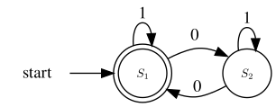

对应的状态机的矩阵表示：

|      | $S_1$ | $S_2$ |
| ---- | ----- | ----- |
| $0$  | $S_2$ | $S_1$ |
| $1$  | $S_1$ | $S_2$ |

再来举一个可乐自动售卖机的例子：

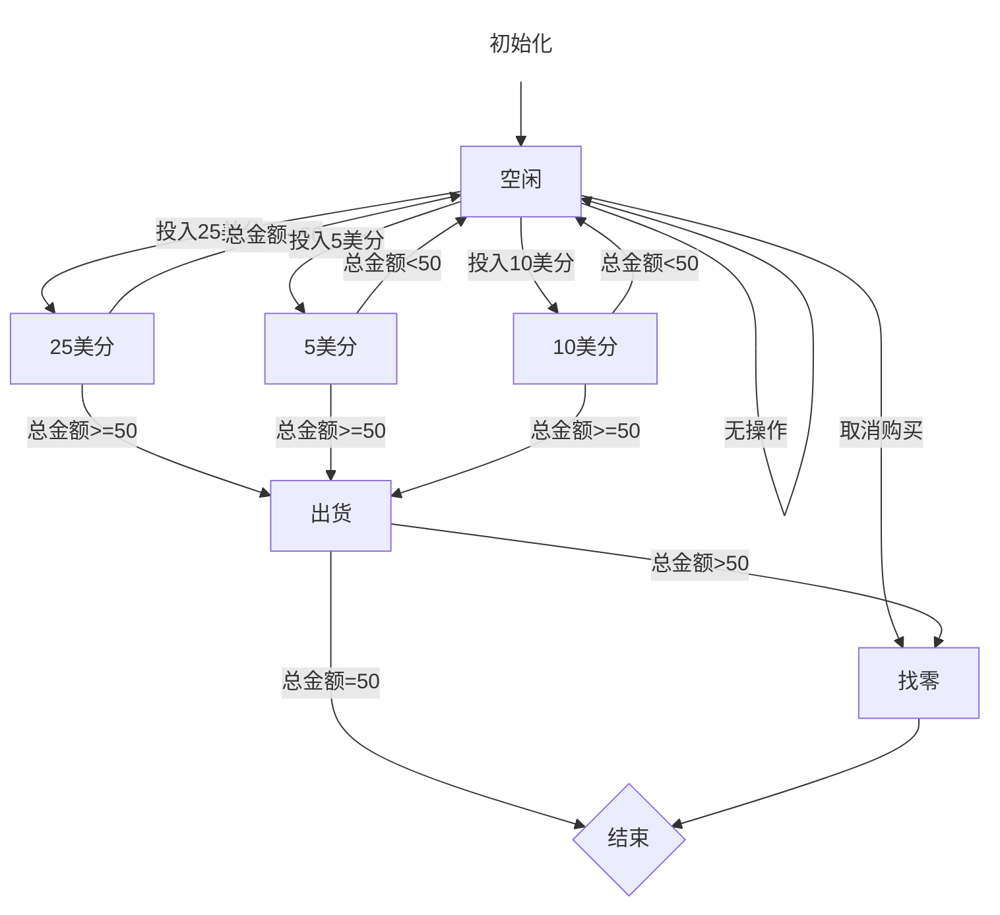

当我们位于「接受状态」（也就是「结束」）时，说明购买成功。图中的每个顶点都代表状态，边代表事件。用户的输入就是一个事件序列。

> 这给了我们一个启发：在写业务逻辑代码时，将业务逻辑抽象成状态机，写出的程序没有$bug$，并且不会出现恐怖的`if`嵌套的情况。要点就是要挖掘出**业务逻辑中所有可能的状态**。

**构建状态转移图**

根据上面的描述，现在可以定义自动机的「状态集合」了。那么怎么挖掘出所有可能的状态呢？一个常用的技巧是，用「当前处理到字符串的哪个部分」当作状态的表述。根据这一技巧，不难挖掘出所有状态：

0. 初始无输入或者只有空格的状态（$S_0$）：`""`或者`"     "`。
1. 输入了数字之后的状态（$S_1$）。`"    123"`。
2. 前面无数字，只输入了 `.` 的状态，`"."`
3. 输入了符号状态`+/-`。
4. 前面有数字和有 `.` 的状态`"123."`
5. $e$ 或者 $E$ 输入后的状态
6. 输入 $e$ 之后输入正负号（$+/-$）的状态
7. 输入 $e$ 后输入数字的状态
8. 前面有有效数输入之后，输入空格的状态`"123.456e10    "`。

共 $9$ 种状态了，难设计的是 $6$，$7$，$8$ 状态。

还有一个无效状态 $-1$ ，也就是当前状态在接收一个输入以后，发现在状态转移图中没有可以跳转的状态，说明输入是不合法的，所以就是无效状态。

分好之后就好办了，设计出根据输入进行状态转换就可以了。

这里的输入事件可以分为：

0. 无效输入，例如：`&`、`(`不是$e$或者$E$的字母等等，`INVALID`。
1. 空格
2. 符号位：$+$和$-$
3. 数字字符
4. 点：`.`
5. 指数符号：$e$ 或者 $E$

转移矩阵 $A$（$9 \times 6$）如下：

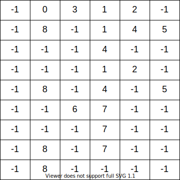

行代表了 9 种状态，列代表了 6 种输入方式也就是 6 种跳转方式。举个例子：$A[0][2]=3$，这有什么含义呢？意思是：第 0 种状态为「初始无输入或者只有空格的状态」，在输入第2种输入「符号位`+/-`」后，会跳转到第3种状态「输入了符号位的状态」。$A[1][1]=8$ 是什么意思呢？意思是：第1种状态为「输入了数字之后的状态」，在输入第1种输入「SPACE=1」后，跳转到了第8种状态「前面有有效数输入之后，输入space的状态」。$A[1][2]=-1$。第1种状态接受到第2种输入，跳转到了无效状态。`"123+"`。

根据以上的解释，大家应该明白什么是状态间的跳转了，这个共 9 种状态，所以是确定有穷自动机。其实难点在于状态的分割，要把每种情况都想到。

而这 $9$ 种状态中：只有 $1$、$4$、$7$、$8$ 这四种状态合法，所以最后状态跳转到这四种状态之一时，说明输入是合法的！

- `"    123   "`
- `"123.456e10    "`
- `"123.456e123a"`
- `"e"`
- `"    "`

输入遍历完以后，如果位于状态`0`、`3`、`2`、`5`、`6`、`-1`，说明字符串不是有效数字。

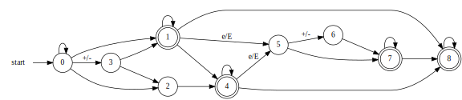

比较上图与「预备知识」一节中对自动机的描述，可以看出有一点不同：

- 我们没有单独地考虑每种字符，而是划分为若干类。由于全部 $10$ 个数字字符彼此之间都等价，因此只需定义一种统一的「数字」类型即可。对于正负号也是同理。

在实际代码中，我们需要处理转移失败的情况。为了处理这种情况，我们可以创建一个特殊的拒绝状态。如果当前状态下没有对应读入字符的「转移规则」，我们就转移到这个特殊的拒绝状态。一旦自动机转移到这个特殊状态，我们就可以立即判定该字符串不「被接受」。

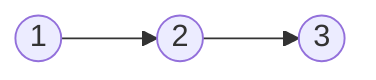

|      | 1    |      |
| ---- | ---- | ---- |
|      |      | 1    |
|      |      |      |

行和列的索引都是顶点的索引。所以$A[0][1] = 1$。

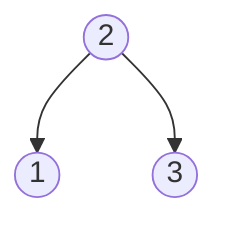


### 代码

```java
class Solution {
    // 下面定义6种事件类型
    private Integer INVALID = 0, SPACE = 1, SIGN = 2, DIGIT = 3, DOT = 4, EXPONENT = 5;
    // 使用二维数组来保存状态机的信息
    // 行索引表示不同的状态
    // 列索引表示不同的事件或者输入
    private Integer[][] transitionTable = {
        {-1,  0,  3,  1,  2, -1},    // 0 no input or just spaces
        {-1,  8, -1,  1,  4,  5},    // 1 input is digits
        {-1, -1, -1,  4, -1, -1},    // 2 no digits in front just Dot
        {-1, -1, -1,  1,  2, -1},    // 3 sign
        {-1,  8, -1,  4, -1,  5},    // 4 digits and dot in front
        {-1, -1,  6,  7, -1, -1},    // 5 input 'e' or 'E'
        {-1, -1, -1,  7, -1, -1},    // 6 after 'e' input sign
        {-1,  8, -1,  7, -1, -1},    // 7 after 'e' input digits
        {-1,  8, -1, -1, -1, -1}
    };
    public boolean isNumber(String s) {
        // 初始状态是0状态
        int state = 0;
        // 设置一个索引值来遍历字符串
        int i = 0;
        // 一个字符一个字符的按顺序从字符串中读取
        while (i < s.length()) {
            // 输入类型默认是无效输入INVALID
            int inputtype = INVALID;
            if (s.charAt(i) == ' ') inputtype = SPACE;
            else if (s.charAt(i) == '-' || s.charAt(i) == '+') inputtype = SIGN;
            else if (s.charAt(i) >= '0' && s.charAt(i) <= '9') inputtype = DIGIT;
            else if (s.charAt(i) == '.') inputtype = DOT;
            else if (s.charAt(i) == 'e' || s.charAt(i) == 'E') inputtype = EXPONENT;
            else inputtype = INVALID;

            // 获取将要跳转到的状态，并赋值给state
            // 下一个状态 = transitionTable[当前状态][输入类型]
            state = transitionTable[state][inputtype];
            // 如果跳转到的状态是-1，说明不合法
            if (state == -1) return false;
            else ++i;
        }
        // 字符串遍历完成以后，判断状态机所处的最终状态是否为合法状态：1,4,7,8
        return state == 1 || state == 4 || state == 7 || state == 8;
    }
}
```

可以使用`HashMap`来表示状态机。

哈希表的key是一个二元组`(行索引，列索引)`

哈希表的value是二元组`(行索引，列索引)`在矩阵中对应的元素的值。

```java
HashMap<Tuple2<Integer, Integer>, Integer> stateMachine;
stateMachine.put(Tuple2.of(0,0), -1);
```

邻接表表示有向图

```java
{
    "顶点1": ["顶点2","顶点3"],
    "顶点2": ["顶点4"],
    "顶点3": ["顶点4"]
}
```

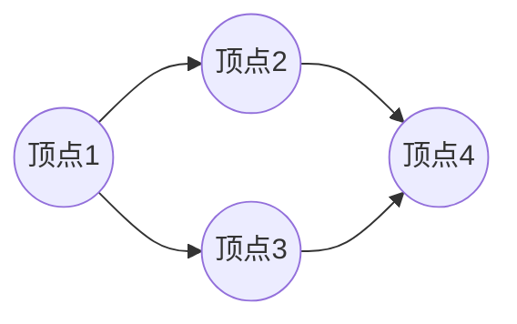


# $2$ 正则表达式匹配

给你一个字符串 `s` 和一个正则表达式模板 `p`，请你来实现一个支持 `'.'` 和 `'*'` 的正则表达式匹配。

- `'.'` 匹配任意单个字符
- `'*'` 匹配零个或一个或多个前面的那一个字符

所谓匹配，是要涵盖整个字符串 `s` 的，而不是部分字符串。

示例1

```
输入：s = "aa" p = "a"
输出：false
解释："a" 无法匹配 "aa" 整个字符串。
```

示例2

```
输入：s = "aa" p = "a*"
输出：true
解释：因为 '*' 代表可以匹配零个或多个前面的那一个元素, 在这里前面的元素就是 'a'。因此，字符串 "aa" 可被视为 'a' 重复了一次。
```

示例3

```
输入：s = "ab" p = ".*"
输出：true
解释：".*" 表示可匹配零个或多个（'*'）任意字符（'.'）。
```

示例4

```
输入：s = "aab" p = "c*a*b"
输出：true
解释：因为 '*' 表示零个或多个，这里 'c' 为 0 个, 'a' 被重复一次。因此可以匹配字符串 "aab"。
```

示例5

```
输入：s = "mississippi" p = "mis*is*p*."
输出：false
```

## $2.1$ 解法一：递归法

我们可以分情况讨论：

1. 如果正则表达式的模板是空字符串，那么判断文本的字符串是否为空。
   1. 如果文本字符串为空，那么匹配成功
   2. 如果文本字符串不为空，那么匹配失败

2. 如果正则表达式**不为空**，那么判断文本的第0个字符和正则表达式的第0个字符是否相等。如果相等，那么继续分情况讨论：
   1. 如果$re[1]=*$，那么继续分情况讨论：
      1. 第0个字符不一定相等的情况：判断$text$和$re[2:]$是否匹配。因为$re$的前两个字符可能是$a*$，这个可以匹配空字符串。所以如果$text$和$re[2:]$匹配成功，那么就匹配成功了。`re[2:]`表示`re.substring(2)`，`aab*`的`substring(2)`是`b*`。举个例子：文本是`bbbb`，正则表达式是`a*bbbb`。
      2. 由于第0个字符相等，也就是说$text[0]=re[0]$，而$re[1]=*$，所以我们只需要判断$text[1:]$和$re$是否匹配就可以了。例如字符串$ab$和$a$$*$$b$是否匹配等价于$b$是否和$a$$*$$b$匹配。大家可以思考一下为什么？`"ab"`和`"a*b"`的匹配问题等价于`"ab"`和`"aa*b"`是否匹配。
   2. 如果$re[1] \neq *$，那么很简单继续向后匹配就可以了，也就是检测$text[1:]$和$re[1:]$是否匹配就行了。

```java
class Solution {
    public boolean isMatch(String text, String pattern) {
        // 如果模板为空，返回文本是否为空的布尔值。
        if (pattern.isEmpty()) return text.isEmpty();
        // 判断第0个字符是否匹配。
        // 1. 文本不能为空
        // 2. 模板的第0个字符和文本的第0个字符相等，或者模板的第0个字符为通配符`.`
        boolean first_match = (!text.isEmpty() &&
                               (pattern.charAt(0) == text.charAt(0) || pattern.charAt(0) == '.'));
        // 防御式编程，首先确保模板的长度大于1，然后第1个字符是`*`
        if (pattern.length() >= 2 && pattern.charAt(1) == '*'){
            // 两种情况是或操作的关系，也就是满足一种情况就可以了。
            // 1. text和pattern[2:]是否匹配
            // 2. 第0个字符匹配，且text[1:]和pattern是否匹配
            return (isMatch(text, pattern.substring(2)) ||
                    (first_match && isMatch(text.substring(1), pattern)));
        } else {
            // pattern[1]不为`*`的情况
            // 第0个字符匹配且text[1:]和pattern[1:]匹配
            return first_match && isMatch(text.substring(1), pattern.substring(1));
        }
    }
}
```

## $2.2$ 解法二：动态规划

由于上面的递归可能不够高效，所以我们需要用动态规划的方式将中间计算结果保存下来，来提升算法的效率。这里我们实现动态规划的方法是 **记忆化搜索** 。我们先来看一下$Fibonacci$数列的程序。

$Fibonacci$数列的递推公式很简单：
$$
F_0 = 0 \\
F_1 = 1 \\
F_N = F_{N-1} + F_{N-2}
$$
所以我们可以很容易的写出程序：

```java
int fibonacci(int n) {
    // 递归的基本条件（退出条件）
    if (n == 0 || n == 1) return n;
    else return fibonacci(n-1) + fibonacci(n-2);
}
```

但这个程序是非常低效的，因为我们做了很多的重复计算。例如当我们求解$F(5)$时，会出现以下的计算过程：

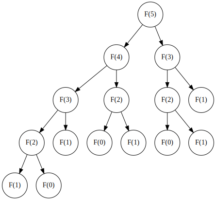

可以看到叶子节点是递归调用的最终计算结果，这个程序计算了$4$次$F(1)$，$3$次$F(0)$。所以我们需要把计算过的结果保存下来，防止重复计算。

**自底向上**

使用循环的方式实现动态规划

```java
int fibonacci(int n) {
    if (n == 0 || n == 1) return n;
    // 索引对应的就是索引的fibonacci数
    int[] dp = new int[n + 1];
    dp[0] = 0;
    dp[1] = 1;
    for (int i = 2; i < n + 1; i++) {
        dp[i] = dp[i-1] + dp[i-2];
    }
    return dp[n];
}
```

**自顶向下**

使用递归的方式实现动态规划，也叫做**记忆化搜索**。

```java
public class Fibonacci {
    // 初始化一个备忘录memo
    // key是n
    // value是n对应的fibonacci数
    private Map<Integer, Integer> memo = new HashMap<>();

    public int fib(int n) {
        if (n == 0 || n == 1) {
            return n;
        }

        // 如果备忘录中包含n对应的fibonacci数
        // 直接返回
        if (memo.containsKey(n)) {
            return memo.get(n);
        }

        // 递归的进行计算
        int result = fib(n - 1) + fib(n - 2);

        // 计算出的结果，保存在备忘录中
        memo.put(n, result);

        // 返回计算结果
        return result;
    }
}
```

```
F(5) --> F(4) + F(3)
1. F(4) --> F(3) + F(2)
2. F(3) --> F(2) + F(1)
如果F(3)先执行，那么F(2)的计算结果会被保存在memo中。
那么F(4)执行的时候，发现F(2)已经在备忘录memo中，所以不会对F(2)进行重复计算。
```


我们接下来看一下正则表达式这道题如何用记忆化搜索的方式来实现动态规划。

由于这个问题存在**最优子结构**，所以我们可以考虑使用动态规划的方法来实现这道题。也就是将中间结果保存起来，供后面使用。

$memo[i][j]$中$i$表示文本字符串的下标，$j$表示模板字符串的下标。

$memo[i][j]$表示$text[i:]$和$pattern[j:]$是否匹配。翻译成$Java$就是`text.substring(i)`和`pattern.substring(j)`是否匹配。这里的$memo$是备忘录（$memoization$）的意思，所以也叫记忆化搜索。

我们在主函数中直接返回了`dp(0, 0, text, pattern)`的调用结果，如果为`true`，则匹配成功。如果为`false`则匹配失败。因为这个`dp`函数是用来检测$text[0:]$和$pattern[0:]$是否匹配的。我们现在分情况讨论：

1. 如果$j等于pattern的长度$，也就是说$pattern[j:]$是一个空字符串，那么只需要看一下$i是否等于text的长度就可以了$。也就是说看一下$text[i:]$是否为空字符串。因为$memo[i][j]$记录的是$text[i:]$和$pattern[j:]$是否匹配。
2. 如果$text[i:]$和$pattern[j:]$都不为空，那么先判断$text[i]$和$pattern[j]$是否相等，如果相等的话，又分为两种情况：
   1. 如果$pattern[j+1] \neq *$，这种情况比较好理解，直接判断$text[i+1:]$和$pattern[j+1:]$是否匹配就行了。因为$*$的处理比较复杂，也是这个程序的难点。
   2. 如果$pattern[j+1] = *$，那么又要分情况考虑了。因为$*$的意思是匹配$0$个或者多个。下面两种情况，只要一种成功，就是匹配成功的。
      1. 匹配$0$个的情况，这种情况不要求$text[i]$和$pattern[j]$相等。由于$pattern[j+1]$是$*$，而我们考虑的是$0$这种情况。也就是$pattern[j]$和$pattern[j+1]$这两个字符忽略掉了，所以我们需要判断的是$text[i:]$和$pattern[j+2:]$是否匹配。也就是说判断$memo[i][j+2] = TRUE$。
      2. 匹配多个的情况。由于我们已经知道$text[i] = pattern[j]$了，而此时我们考虑的是匹配$1$个$pattern[j]$或者多个$pattern[j]$的情况。<span style="color:red">所以$memo[i][j]$是否为$TRUE$，等价于$memo[i+1][j]$是否为$TRUE$。</span> 也就是说`text[i:]`和`pattern[j:]`是否匹配等价于`text[i+1:]`和`pattern[j:]`是否匹配。`ab`和`a*b`等价于`b`和`a*b`。

```java
// memo二维数组中的值
enum Result {
    TRUE, FALSE
}

class Solution {
    // 声明备忘录
    Result[][] memo;

    public boolean isMatch(String text, String pattern) {
        // 初始化备忘录
        memo = new Result[text.length() + 1][pattern.length() + 1];
        // 返回text[0:]和pattern[0:]是否为TRUE
        // 也就是memo[0][0]是否为TRUE
        return dp(0, 0, text, pattern);
    }

    public boolean dp(int i, int j, String text, String pattern) {
        // 递归基本条件
        if (memo[i][j] != null) {
            return memo[i][j] == Result.TRUE;
        }
        boolean ans;
        if (j == pattern.length()){
            // 如果pattern[j:]为空字符串
            // 那么结果就是text[i:]是否为空字符串
            ans = i == text.length();
        } else{
            // 首字符匹配结果
            boolean first_match = (i < text.length() &&
                                   (pattern.charAt(j) == text.charAt(i) ||
                                    pattern.charAt(j) == '.'));

            if (j + 1 < pattern.length() && pattern.charAt(j+1) == '*'){
                // 1. memo[i][j+2]是否为TRUE：dp(i, j+2, text, pattern)
                // 2. 首字符匹配且memo[i+1][j]是否为TRUE：dp(i+1, j, text, pattern)
                ans = (dp(i, j+2, text, pattern) ||
                       first_match && dp(i+1, j, text, pattern));
            } else {
                // pattern[j+1] != '*'的情况
                // 首字符匹配且memo[i+1][j+1]为TRUE
                ans = first_match && dp(i+1, j+1, text, pattern);
            }
        }
        // 将计算结果保存在备忘录中
        memo[i][j] = ans ? Result.TRUE : Result.FALSE;
        return ans;
    }
}
```


## $2.3$ 解法三：实现一个正则表达式引擎

### $2.3.1$ 有向图

定义：有向图是由一组顶点和一组有方向的边组成的，每条有方向的边都连接着有序的一对顶点。

链表和树是有向图的特殊情况。

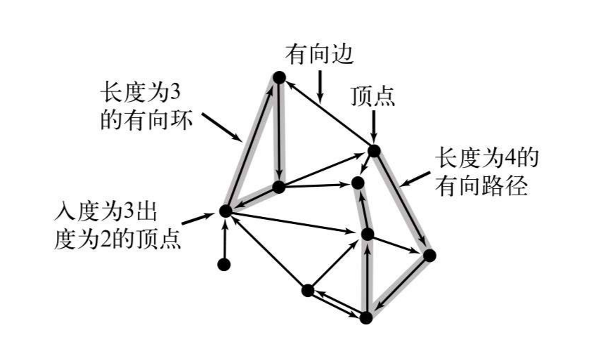

有向图的数据结构表示（邻接表）：

```java
// Directed Graph
public class DiGraph{
    // 数组中的每个元素是一个Set数据结构，用来表示索引的邻居
    // 例如索引为0的元素如果是(1,2,3)，那么说明存在
    // 0 -> 1; 0 -> 2; 0 -> 3;
    // 也就是从0出发有三条边，0有三个邻居（adjacent）
    private Set<Integer>[] adj;
    // 有向图中顶点（Vertex）的数量
    private int V;

    // 构造期用来实例化一个有向图
    public DiGraph(int V) {
        this.V = V;
        adj = (HashSet<Integer>[]) new HashSet[V];
        // 针对每一个顶点编号，都初始化一个空的Set集合
        for (int v = 0; v < V; v++) {
            adj[v] = new HashSet<Integer>();
        }
    }

    // 添加一条v -> w的边
    public void addEdge(int v, int w) {
        // adj[v]是Set集合，用来保存v指向的所有顶点
        adj[v].add(w);
    }

    // 返回v的邻居
    public Set<Integer> adj(int v) {
        return adj[v];
    }

    // 有向图中顶点的数量
    public int V() {
        return V;
    }
}
```

示意图如下：

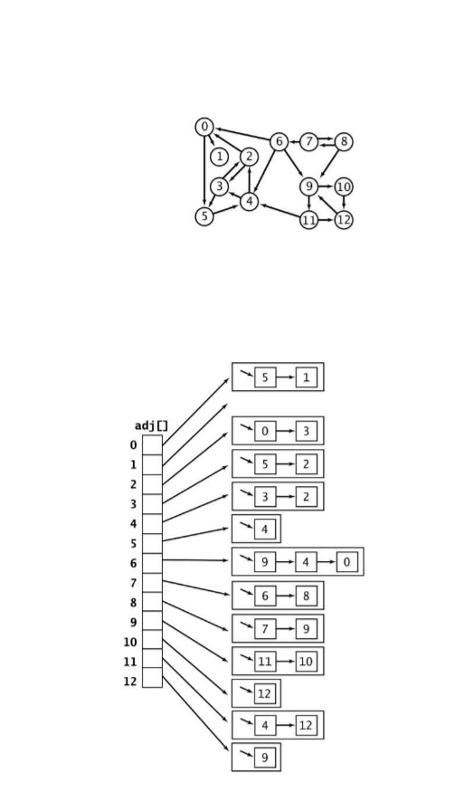

**深度优先搜索**（$DFS，Depth \; First \; Search$）：

我们使用深度优先搜索的方式来遍历有向图。

```java
public class DirectedDFS {
    // marked数组用来记录一个顶点是否被遍历过
    // 遍历过的顶点需要标记
    private boolean[] marked;
    // 有向图的数据结构
    private DiGraph G;
    // 构造函数1：实例化的时候，就遍历一下s顶点能到达的所有顶点。
    public DirectedDFS(DiGraph G, int s) {
        // 初始化marked数组
        marked = new boolean[G.V()];
        // 从s定点开始在图中做深度有限搜索，能够到达的顶点
        // 在marked数组中标记为true
        dfs(G, s);
    }
    // 构造函数2：多点可达性
    // S是一些顶点索引构成的集合
    // 遍历集合中的所有顶点能够到达的顶点
    public DirectedDFS(DiGraph G, Set<Integer> S) {
        // 初始化marked数组
        marked = new boolean[G.V()];
        // 遍历集合S中的所有顶点
        for (int s : S) {
            // 如果顶点已经被访问过，那么直接跳过。
            if (marked[s]) continue;
            // 从顶点s开始深度优先搜索
            dfs(G, s);
        }
    }
    // 单点可达性
    private void dfs(DiGraph G, int s) {
        // 先将顶点s标记为遍历过
        marked[s] = true;
        // 遍历s的所有邻居
        for (int v : G.adj(s)) {
            // 如果s的邻居v被标记为遍历过，则忽略
            if (marked[v]) continue;
            // 递归的去遍历v和v的所有邻居
            dfs(G, v);
        }
    }

    public boolean marked(int v) {
        return marked[v];
    }
}
```

我们来画张图举个例子：

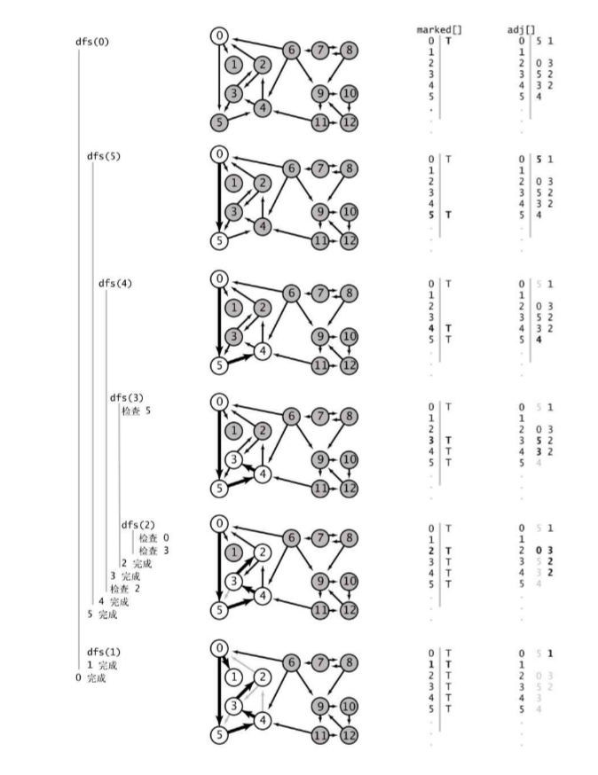

有向图深度有限搜索的应用：

**垃圾收集$——$标记清除算法（Mark-Sweep）**

多点可达性的一个重要的实际应用是在典型的内存管理系统中，包括许多$Java$的实现。在一幅有向图中，一个顶点表示一个对象，一条边则表示一个对象对另一个对象的引用。这个模型很好地表现了运行中的$Java$程序的内存使用状况。在程序执行的任何时候都有某些对象是可以被直接访问的，而不能通过这些对象访问到的所有对象都应该被回收以便释放内存。$标记—清除$的垃圾回收策略会为每个对象保留一个位做垃圾收集之用。它会周期性地运行一个类似于$DirectedDFS$的有向图可达性算法来标记所有可以被访问到的对象，然后清理所有对象，回收没有被标记的对象，以腾出内存供新的对象使用。

```java
ObjectA, ObjectB, ObjectC, ObjectD
ObjectA.next = ObjectB
ObjectB.next = ObjectC
```

整个过程其实就两步：

1. $DFS$标记出正在使用的内存块
2. 遍历所有内存块，将未被标记的内存块释放

示意图如下：

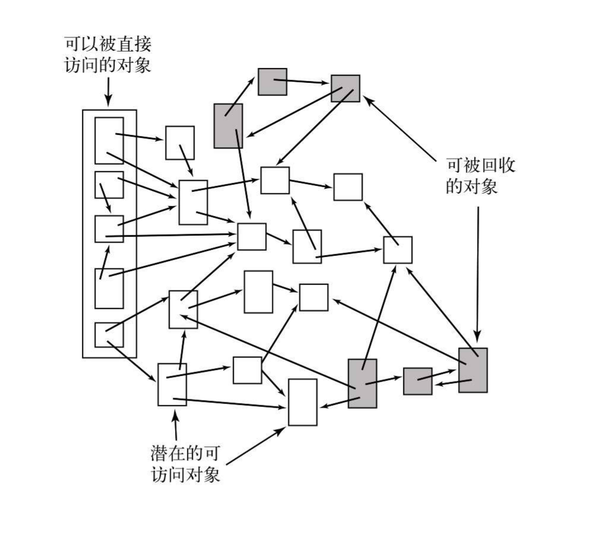

我们这里给出伪代码，因为时间不够，没办法使用$Java$来写一个标记清除算法。

```
Mark(root)
    If markedBit(root) = false then
        markedBit(root) = true
        For each v referenced by root
             Mark(v)
             
Sweep()
For each object p in heap
    If markedBit(p) = true then
        markedBit(p) = false
    else
        heap.release(p)
```

**stop the world(stw)**。

### $2.3.2$ 正则表达式

正则表达式由四种基本的模式构成：

1. **连接操作**：当我们写出$AB$时，就指定了一种语言$\{AB\}$。它含有一个由两个字符组成的字符串，由$A$和$B$连接而成。匹配`"AB"`。
2. **或操作**：或操作可以在模式中指定多种可能的匹配。如果我们在两种选择之间指定了一个或运算符，那么它们都将属于同一种语言。我们用竖线符号$|$表示这个操作。例如，$A|B$指定的语言是$\{A, B\}$, $A|E|I|O|U$指定的语言是$\{A, E, I, O, U\}$。连接操作的优先级高于或操作，因此$AB|BCD$指定的语言是$\{AB, BCD\}$。
3. **闭包操作**：闭包操作可以将模式的部分重复任意的次数。模式的闭包是由将模式和自身连接任意多次（包括零次）而得到的所有字符串所组成的语言。我们将$*$标记在需要被重复的模式之后，以表示闭包。闭包操作的优先级高于连接操作，因此$AB*$指定的语言由一个$A$和$0$个或多个$B$的字符串组成，而$A$$*$$B$指定的语言由$0$个或多个$A$和一个$B$的字符串组成。空字符串的记号是$\epsilon$，它存在于所有文本字符串之中（包括$A*$）。和$JS$中的闭包不是一回事儿。
4. **括号操作**：我们使用括号来改变默认的优先级顺序。例如，$C(AC|B)D$指定的语言是$\{CACD,CBD\}$，$ (A|C) ((B|C)D)$指定的语言是$\{ABD, CBD, ACD, CCD\}$，$(AB)*$指定的语言是由将$AB$连接任意多次得到的所有字符串和空字符串组成的$\{\epsilon, AB, ABAB, ...\}$这些简单的例子已经可以写出虽然复杂但却清晰而完整的描述某种语言的正则表达式了。某些语言可能可以用其他方式简单表述，但找到这些简单的方法可能会比较困难。例如，表格的最后一行中的正则表达式指定的就是$(A|B)*$的一个只含有偶数个$B$的子集。

| 正则表达式                         | 匹配的字符串        | 不匹配的字符串    |
| ---------------------------------- | ------------------- | ----------------- |
| $(A|B)(C|D)$                       | $AC,AD,BC,BD$       | 其他所有字符串    |
| $A(B|C)$$*$$D$                     | $AD,ABD,ACD,ABCCBD$ | $BCD,ADD,ABCBC$   |
| $A$$*$$|(A$$*$$BA$$*$$BA$$*$$)$$*$ | $AAA,BBAABB,BABAAA$ | $ABA,BBB,BABBAAA$ |

**正则表达式的缩略写法**

- 通配符：点`.`表示通配，如果用基本正则表达式的语法写会非常繁琐，是这样的：$(A|B|C...|Z|a|b|c...|z|...)$，也就是说需要把所有的字符都列举一遍。
- 集合：$[a-z][0-9]$或者$[ABCDE]$$*$。其实表示的是或操作。
- 补集：$[^\wedge ABEDF]$，其实也是或操作。
- `+`：至少重复一次。$(AB)+$的原始写法$(AB)(AB)*$
- `?`：匹配$0$次或者$1$次。$(AB)?$的原始写法是：$\epsilon|AB$。
- `{}`：重复指定次数。$(AB)\{3\}$的原始写法是$(AB)(AB)(AB)$。还可以指定重复次数的范围。例如，$(AB)\{1$-$2\}$的原始写法是：$(AB)|(AB)(AB)$。

所以我们实现了最基本的四种操作，就实现了一个完整的正则表达式引擎了！

### $2.3.3$ 非确定性有限状态自动机（NFA）

要处理正则表达式，就需要一种更加强大的抽象自动机。因为或操作的存在，自动机无法仅根据一个字符就判断出模式是否出现；事实上，因为闭包的存在，自动机甚至无法知道需要检查多少字符才会出现匹配失败。为了克服这些困难，我们需要非确定性的自动机：当面对匹配模式的多种可能时，自动机能够“猜出”正确的转换！你也许会认为这种能力是不可能的，但你会看到，编写一个程序来构造非确定有限状态自动机（$NFA$）并有效模拟它的运行是很简单的。

- 构造和给定正则表达式相对应的非确定有限状态自动机；
- 模拟$NFA$在给定文本上的运行轨迹。

在学习如何构造模式匹配的$NFA$之前，先来看一个示例，它说明了$NFA$的性质和操作。下面的图所显示的$NFA$是用来判断一段文本是否包含在正则表达式$((A$$*$$B|AC)D)$所描述的语言之中。如这个示例所示，我们所定义的$NFA$有着以下特点。

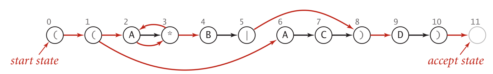

- 长度为$M$的正则表达式中的每个字符在所对应的$NFA$中都有且只有一个对应的状态。$NFA$的起始状态为$0$并含有一个（虚拟的）接受状态$M$。
- 字母表（A...Z）中的字符所对应的状态都有一条从它指出的边，这条边指向模式中的下一个字符所对应的状态（图中的黑色的边）。
- 元字符`(`、`)`、`|`和`*`所对应的状态至少含有一条指出的边（图中的红色的边），这些边可能指向其他的任意状态。
- 有些状态有多条指出的边，但一个状态只能有一条指出的黑色边。

我们约定将所有的模式都包含在括号中，因此$NFA$中的第一个状态对应的是左括号，而最后一个状态对应的是右括号（并能够转换为接受状态）。和上一道题讲过的$DFA$一样，在$NFA$中也是从状态$0$开始读取文本中的第0个字符。$NFA$在状态的转换中**有时**会从文本中读取字符，从左向右一次一个。但它和$DFA$有着一些基本的不同：

状态在接受到空字符串输入（$\epsilon$）时，可能发生状态的跳转。

- 在图中，正则表达式中的字符对应的是结点而不是边；
- $NFA$只有在读取了文本中的所有字符之后才能识别它，而$DFA$并不一定需要读取文本中的全部内容就能够识别一个模式。

这些不同并不是关键$——$我们选择的是最适合研究的算法的自动机版本。现在的重点是检查文本和模式是否匹配$——$为了达到这个目标，自动机需要读取所有文本并到达它的接受状态。在$NFA$中从一个状态转移到另一个状态的规则也与$DFA$不同$——$在$NFA$中状态的转换有以下两种方式，见下图。

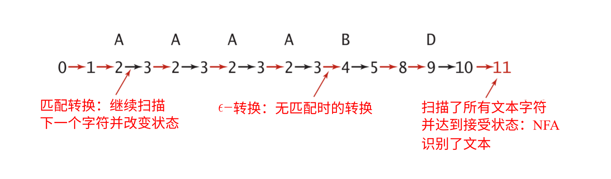

- 如果当前状态和字母表（A...Z）中的一个字符相对应且文本中的当前字符和该字符相匹配，自动机可以扫过文本中的该字符并（由黑色的边）转换到下一个状态。我们将这种转换称为**匹配转换**。
- 自动机可以通过红色的边转换到另一个状态而不扫描文本中的任何字符。我们将这种转换称为$\epsilon$-转换，也就是说它所对应的“匹配”是一个空字符串$\epsilon$。

例如，假设输入为$A \; A \; A \; A \; B \; D$并启动正则表达式$((A*B|AC)D)$所对应的自动机（起始状态为$0$）。上面的图显示的一系列状态转换最终到达了接受状态。这一系列的转换说明输入文本属于正则表达式所描述的字符串的集合$——$即文本和模式相匹配。按照$NFA$方式，我们称该$NFA$识别了这段文本。

下图的例子说明了即使对于类似于$A \; A \; A \; A \; B \; D$这种$NFA$本应该能够识别的输入文本，也可以找到一个使$NFA$停滞的状态转换序列。例如，如果$NFA$选择在扫描完所有$A$之前就转换到状态$4$，它就无法再继续前进了，因为离开状态$4$的唯一办法是匹配$B$。这两个例子说明了这种自动机的不确定性。在扫描了一个$A$并到达状态$3$之后，$NFA$面临着两个选择：它可以转换到状态$4$，或者回到状态$2$。这次选择或者会使它最终达到接受状态（如第一个例子所示）或者进入停滞（如第二个例子所示）。$NFA$在状态$1$时也需要进行选择（是否由$\epsilon$-转换到达状态$2$或者状态$6$）。

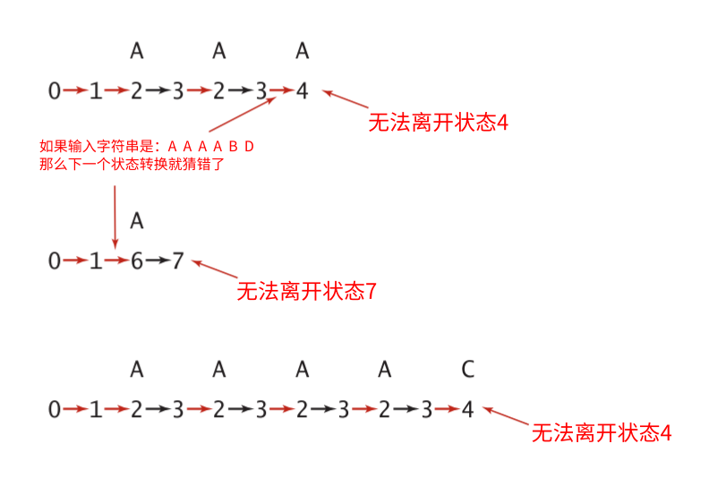

这个例子说明了$NFA$和$DFA$之间的关键区别：因为在$NFA$中离开一个状态的转换可能有多种，因此从这种状态可能进行的转换是不确定的$——$即使不扫描任何字符，它在不同的时间所进行的状态转换也可能是不同的。要使这种自动机的运行有意义，所设想的$NFA$必须能够猜测对于给定的文本进行哪种转换（如果有的话）才能最终到达接受状态。换句话说，当且仅当一个$NFA$从状态$0$开始从头读取了一段文本中的所有字符，进行了一系列状态转换并最终到达了接受状态时，称该$NFA$识别了一个文本字符串。相反，当且仅当对于一个$NFA$没有任何匹配转换和$\epsilon$-转换的序列能够扫描所有文本字符并到达接受状态时，则称该$NFA$无法识别这段文本字符串。

和$DFA$一样，这里列出所有状态的转换即可跟踪$NFA$处理文本字符串的轨迹。任意类似的结束于最终状态的转换序列都能证明某个自动机识别了某个字符串（也可能有其他的证明）。但对于一段给定的文本，应该如何找到这样一个序列呢？对于另一段给定的文本我们应该如何证明不存在这样一个序列呢？这些问题的答案比你想象的要简单，即系统地尝试所有的可能性！

#### $2.3.3.1$ 模拟$NFA$的执行

存在能够猜测到达接受状态所需的状态转换自动机的设想就好像能够写出解决任意问题的程序一样：这看起来很荒谬。经过仔细思考，你会发现这个任务从概念上来说并不困难：我们可以检查所有可能的状态转换序列，只要存在能够到达接受状态的序列，我们就会找到它。

**自动机的表示**

首先，需要能够表示$NFA$。选择很简单：正则表达式本身已经给出了所有状态名（$0$到$M$之间的整数，其中$M$为正则表达式的长度）。还有一个接受状态，所以图数据结构的顶点数量是$M+1$。用`char`数组`re[]`保存正则表达式本身，这个数组也表示了匹配的转换（如果`re[i]`存在于字母表中，那么就存在一个从`i`到`i+1`的匹配转换）。$\epsilon$-转换最自然的表示方法当然是有向图$——$它们都是连接$0$到$M$之间的各个顶点的有向边（红色边）。因此，我们用有向图$G$表示所有$\epsilon$-转换。在讨论模拟的过程之后将讨论由给定正则表达式构建有向图的任务。对于上面的例子，它的有向图含有以下$9$条边：

- 0$\rightarrow$1
- 1$\rightarrow$2
- 1$\rightarrow$6
- 2$\rightarrow$3
- 3$\rightarrow$2
- 3$\rightarrow$4
- 5$\rightarrow$8
- 8$\rightarrow$9
- 10$\rightarrow$11

以上$9$条边都是$\epsilon$-转换。也就是通过空字符串可以到达的状态。

我们需要构建一个有向图，有向图中之存在红色的边（空转换）。

**$NFA$的模拟与可达性**

为了模拟$NFA$的运行轨迹，我们会记录自动机在检查当前输入字符时可能遇到的所有状态的集合。我们会查找所有从状态$0$通过$\epsilon$-转换可达的状态来初始化这个集合。对于集合中的每个状态，检查它是否可能与第一个输入字符相匹配。检查并匹配之后就得到了$NFA$在匹配第一个字符之后可能到达的状态的集合。这里还需要向该集合中加入所有从该集合中的任意状态通过$\epsilon$-转换可以到达的其他状态。有了这个匹配了第一个字符之后可能到达的所有状态的集合，$\epsilon$-转换有向图中的多点可达性问题的答案就是可能匹配第二个输入字符的状态集合。例如，在示例$NFA$中初始状态集合为$\{0,1,2,3,4,6\}$，如果第一个输入字符为$A$，那么$NFA$通过匹配转换可能到达的状态是$\{3,7\}$，然后它可能进行$3$到$2$或$3$到$4$的$\epsilon$-转换，因此可能与第二个字符匹配的状态集合为$\{2,3,4,7\}$。重复这个过程直到文本结束可能得到两种结果：

- 可能到达的状态集合中含有接受状态；
- 可能到达的状态集合中不含有接受状态。

第一种结果说明存在某种转换序列使$NFA$到达接受状态。第二种结果说明对于该输入$NFA$总是会停滞，导致匹配失败。使用我们已经实现了的`SET`数据类型和用于在有向图中解决多点可达性问题的`DirectedDFS`类，下面的$NFA$模拟代码只是翻译了刚才的描述。你可以用下面的图检查你对这段代码的理解，它显示了样例输入的完整轨迹。


我们来看一下代码：

将正则表达式转换成NFA有向图，图中只有红色边（空转换）存在。

```java
public boolean recognizes(String txt) {
    Set<Integer> pc = new HashSet<Integer>();
    // G是正则表达式生成的NFA有向图
    // 从初始状态0深度优先搜索，标记所有可能到达的顶点（状态）
    DirectedDFS dfs = new DirectedDFS(G, 0);
    // 将0通过空转换能够到达的顶点，保存在pc集合中。
    for (int v = 0; v < G.V(); v++) {
        // 如果标记过，添加到pc集合
        if (dfs.marked(v)) pc.add(v);
    }
    // 遍历文本字符串
    for (int i = 0; i < txt.length(); i++) {
        // match集合表示txt[i]通过匹配转换能够到达的顶点集合
        Set<Integer> match = new HashSet<Integer>();
        // 通过匹配转换能够到达的顶点，也就是txt[i] -> txt[i+1]
        // 当i==0时，pc集合是0状态通过匹配转换能够到达的状态的集合
        for (int v : pc) {
            // 索引必须小于正则表达式的长度
            if (v < M) {
                // 如果正则表达式re[v]是通配符，或者和txt[i]相等
                // 那么将索引v+1添加到match集合
                if (re[v] == '.' || re[v] == txt.charAt(i)) match.add(v + 1);
            }
        }
        
        // 将pc置为空
        pc = new HashSet<Integer>();
        // 对match集合（匹配转换后的顶点的集合）做dfs
        // 通过红色的边进行dfs
        dfs = new DirectedDFS(G, match);
        // 遍历所有顶点，标记过的添加到pc集合中
        for (int v = 0; v < G.V(); v++) {
            if (dfs.marked(v)) pc.add(v);
        }
    }
    // 如果遍历完文本以后，能够到达的顶点包含接受状态，那么说明匹配成功
    // 接受状态的索引是M
    return pc.contains(M);
}
```

#### $2.3.3.2$ 构造与正则表达式对应的$NFA$

- 有向图中的顶点：正则表达式中的字符的索引
- 有向图中的边：所有顶点之间能够存在的空转换

根据上一小节开头讨论的$NFA$表示，这里只需要构造一个由所有$\epsilon$-转换组成的有向图$G$。正则表达式本身和本节开头学习过的形式定义足以提供所需的所有信息。根据$Dijkstra$的算法，我们会使用一个**栈**来记录所有**左括号**和**或**运算符的位置（索引）。

**连接操作**

对于$NFA$，连接操作是最容易实现的了。状态的匹配转换和字母表中的字符的对应关系就是连接操作的实现。

**括号**

我们要将正则表达式字符串中所有左括号的索引压入栈中。每当我们遇到一个右括号，我们最终都会用后文所述的方式将左括号从栈中弹出。和$Dijkstra$算法一样，栈可以很自然地处理嵌套的括号。

**闭包操作**

闭包运算符`*`只可能出现在

1. 单个字符之后（此时将在该字符和`*`之间添加相互指向的两条$\epsilon$-转换），或者是
2. 右括号之后，此时将在对应的左括号（即栈顶元素）和`*`之间添加相互指向的两条$\epsilon$-转换。

**或表达式**

在形如$(A|B)$的正则表达式中，$A$和$B$也都是正则表达式。我们的处理方式是添加两条$\epsilon$-转换：一条从左括号所对应的状态指向$B$中的第一个字符所对应的状态，另一条从`|`字符所对应的状态指向右括号所对应的状态。将正则表达式字符串中`|`运算符的索引（以及如上文所述的左括号的索引）压入栈中，这样在到达右括号时这些所需信息都会在栈的顶部。这些$\epsilon$-转换使得$NFA$能够在这两者之间进行选择。此时并没有像平常一样添加一条从`|`运算符所对应的状态到下一个字符所对应的状态的$\epsilon$-转换$——NFA$离开“或”运算符的唯一方式就是通过某种状态转换到达右括号所对应的状态。

这些简单的规则足以构造任意复杂的正则表达式所对应的$NFA$。下面的算法实现了这些规则。它的构造函数创建了给定正则表达式所对应的$\epsilon$-转换有向图。该算法处理样例的轨迹下图所示。$NFA$构造过程所需的代码非常少，是我们所见过的最巧妙的算法之一。


例如正则表达式$(.*AB((C|D*E)F)*G)$所对应的$NFA$如下图

元字符（`(`，`)`，`*`）可以通过空转换转移到下一个状态。

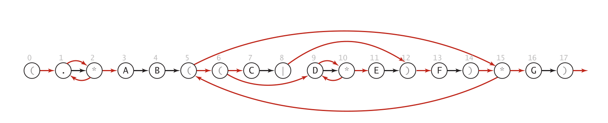

构造$NFA$的算法如下：

```java
public class NFA {
    // 将正则表达式字符串转换成字符数组re
    private char[] re;
    private DiGraph G;
    // 正则表达式的长度
    private int M;

    // 构造函数：构造一个正则表达式对应的NFA有向图
    public NFA(String regexp) {
        // 初始化一个栈，用来保存(和|
        Stack<Integer> ops = new Stack<Integer>();
        // 将正则表达式字符串转换成字符数组re
        re = regexp.toCharArray();
        M = re.length;
        // 初始化一个顶点数量是M+1的有向图
        // 索引为M的顶点是接受状态。
        G = new DiGraph(M + 1);
        // 便利正则表达式数组re
        for (int i = 0; i < M; i++) {
            // 缓存索引i
            int lp = i;
            // 如果字符是(或者|，那么压栈
            if (re[i] == '(' || re[i] == '|')
                ops.push(i);
            // 处理右括号
            else if (re[i] == ')') {
                // 弹出栈顶运算符的索引
                int or = ops.pop();
                // 如果栈顶运算符是|
                if (re[or] == '|') {
                    // 弹出左括号索引
                    lp = ops.pop();
                    // 将左括号和|的下一个顶点连接
                    G.addEdge(lp, or + 1);
                    // 将|和右括号顶点连接
                    G.addEdge(or, i);
                } else {
                    // 如果弹出的是左括号的索引
                    lp = or;
                }
            }
            if (i < M - 1 && re[i+1] == '*') {
                // 1. 如果lp是右括号的索引，那么和下一个字符互相指向
                // 2. 如果re[i]是字母或者点，那么和下一个字符互相指向
                G.addEdge(lp, i+1);
                G.addEdge(i+1, lp);
            }
            if (re[i] == '(' || re[i] == '*' || re[i] == ')')
                // (,*,)和下一个字符连接
                G.addEdge(i, i + 1);
        }
    }

    public boolean recognizes(String txt) {
        Set<Integer> pc = new HashSet<Integer>();
        DirectedDFS dfs = new DirectedDFS(G, 0);
        for (int v = 0; v < G.V(); v++) {
            if (dfs.marked(v)) pc.add(v);
        }
        for (int i = 0; i < txt.length(); i++) {
            Set<Integer> match = new HashSet<Integer>();
            for (int v : pc) {
                if (v < M) {
                    if (re[v] == '.' || re[v] == txt.charAt(i))
                        match.add(v + 1);
                }
            }
            pc = new HashSet<Integer>();
            dfs = new DirectedDFS(G, match);
            for (int v = 0; v < G.V(); v++) {
                if (dfs.marked(v)) pc.add(v);
            }
        }
        return pc.contains(M);
    }
}
```

该构造函数根据给定的正则表达式构造了对应的$NFA$的$\epsilon$-转换有向图。

程序运行过程的示意图如下：

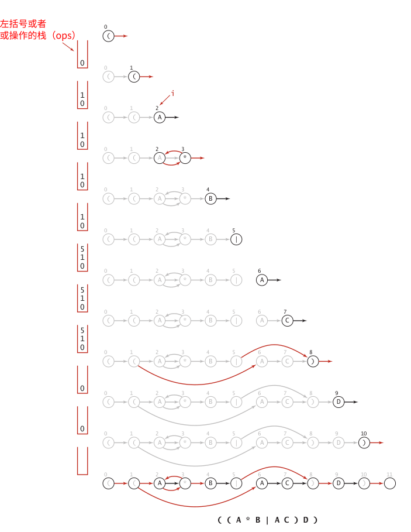

我们可以用以上的代码来实现一个`Linux`系统中的`GREP`命令。

```java
public class GREP {
    public static void main(String[] args) {
        String regexp = "(.*" + args[0] + ".*)";
        NFA nfa = new NFA(regexp);
        BufferedReader buffer = 
            new BufferedReader(new InputStreamReader(System.in));
        String line;
        while ((line = buffer.readLine()) != null) {
            if (nfa.recognizes(line)) System.out.println(line);
        }
    }
}
```

我们可以这样来使用这个程序。

```bash
$ java GREP "(A*B|AC)D" < test.txt
```

红黑树：

- `Java`的`TreeSet`
- `C++`的`set`
- Linux内核中的`epoll`特性
- Nginx的定时器

写代码的步骤：

1. 把程序跑起来
2. 保证程序的正确性
3. 优化程序

TCP/IP：

滑窗算法。

HTTP/RPC协议

JAVA：

- 线程池（Executor）
- Future特性
- 一些设计模式（工厂模式，访问者模式）
- Maven的高级使用
- 堆排序/快速排序
