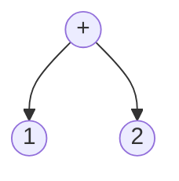
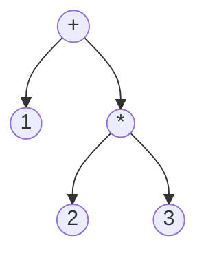
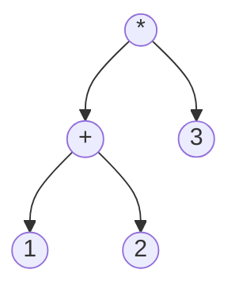

## 后缀表达式的定义

**中缀表达式**

```
a + b * c + (d * e + f) * g
```

**后缀表达式**

```
a b c * + d e * f + g * +
```

举几个例子：

```
1 + 2
```

转换以后得到：

```
1 2 +
```

```
1 + 2 * 3
```

转换以后得到：

```
1 2 3 * +
```

```
(5 + (2 + 3) * 8 + 3) * 6
```

转换以后得到：

```
6 5 2 3 + 8 * + 3 + *
```

我们可以通过分析表达式中的优先级来手动的将中缀表达式转换成后缀表达式。

转换成后缀表达式以后，我们发现后缀表达式是没有括号的，但能计算得到正确的结果。

## 后缀表达式的求值

```java
import java.util.Stack;

public class BasicCalculator {
    public static void main(String[] args) {
//        String s = "6523+8*+3+*";
        String s = "62-";
        Stack<Integer> stack = new Stack<>();
        for (int i = 0; i < s.length(); i++) {
            if (s.charAt(i) == '+') {
                int a = stack.pop();
                int b = stack.pop();
                stack.push(a + b);
            } else if (s.charAt(i) == '*') {
                int a = stack.pop();
                int b = stack.pop();
                stack.push(a * b);
            } else if (s.charAt(i) == '-') {
                int b = stack.pop();
                int a = stack.pop();
                stack.push(a - b);
            } else if (s.charAt(i) == '/') {
                int b = stack.pop();
                int a = stack.pop();
                stack.push(a / b);
            } else {
                stack.push(Character.getNumericValue(s.charAt(i)));
            }
        }
        System.out.println(stack.pop());
    }
}
```

## 使用栈将中缀表达式转换成后缀表达式

```java
import java.util.HashMap;
import java.util.Stack;

public class InfixToPostfix {
    public static void main(String[] args) {
        HashMap<Character, Integer> priority = new HashMap<>();
        priority.put('+', 1);
        priority.put('-', 1);
        priority.put('*', 2);
        priority.put('/', 2);
        priority.put('(', 3);

        String output = "";
        Stack<Character> operatorStack = new Stack<>();

        String s = "a+b*c+(d*e+f)*g";
        for (int i = 0; i < s.length(); i++) {
            if (s.charAt(i) == '+' ||
                    s.charAt(i) == '-' ||
                    s.charAt(i) == '*' ||
                    s.charAt(i) == '/' ||
                    s.charAt(i) == '(') {
                while (!operatorStack.isEmpty() &&
                        operatorStack.peek() != '(' &&
                        priority.get(operatorStack.peek()) >= priority.get(s.charAt(i))) {
                    output += operatorStack.pop();
                }
                operatorStack.push(s.charAt(i));
            } else if (s.charAt(i) == ')') {
                while (!operatorStack.isEmpty() && operatorStack.peek() != '(') {
                    output += operatorStack.pop();
                }
                if (!operatorStack.isEmpty() && operatorStack.peek() == '(') operatorStack.pop();
            } else {
                output += s.charAt(i);
            }
        }
        while (!operatorStack.isEmpty()) output += operatorStack.pop();
        System.out.println(output);
    }
}
```

## 表达式求值思路

1. 将中缀表达式转换成后缀表达式
2. 对后缀表达式进行求值

## 表达式的抽象语法树表示

`1 + 2`



`1+2*3`



`(1+2)*3`



中序遍历加上括号就是中缀表达式。

后序遍历就是后缀表达式。

使用抽象语法树的方式进行求值：

```java
public class ASTCalc {
    public static void main(String[] args) {
        // (1+2)*3
        ASTNode expr = new Operator(
                '*',
                new Operator(
                        '+',
                        new Number(1),
                        new Number(2)
                ),
                new Number(3)
        );

        // 后序遍历求值
        System.out.println(eval(expr));
    }

    public static Integer eval(ASTNode ast) {
        if (ast instanceof Number) return ((Number) ast).value;
        else if (ast instanceof Operator) {
            Character operator = ((Operator) ast).operator;
            Integer leftValue = eval(((Operator) ast).leftExpr);
            Integer rightValue = eval(((Operator) ast).rightExpr);
            if (operator == '+') return leftValue + rightValue;
            else if (operator == '-') return leftValue - rightValue;
            else if (operator == '*') return leftValue * rightValue;
            else if (operator == '/') return leftValue / rightValue;
        }

        throw new RuntimeException("运算符无法识别");
    }

    public static abstract class ASTNode {}

    public static class Number extends ASTNode {
        public Integer value;

        public Number(Integer value) {
            this.value = value;
        }

        @Override
        public String toString() {
            return value.toString();
        }
    }

    public static class Operator extends ASTNode {
        public Character operator;
        public ASTNode leftExpr;
        public ASTNode rightExpr;

        public Operator(Character operator, ASTNode leftExpr, ASTNode rightExpr) {
            this.operator = operator;
            this.leftExpr = leftExpr;
            this.rightExpr = rightExpr;
        }

        @Override
        public String toString() {
            return "(" + leftExpr.toString() + operator + rightExpr.toString() + ")";
        }
    }
}
```

那么，问题来了，如何将表达式的字符串转换成抽象语法树呢？

## EBNF 语法

```ebnf
expression = term ( addop term )*.
term       = factor ( mulop factor )*.
factor     = "(" expression ")" | number.
addop      = "+" | "-".
mulop      = "*" | "/". 
number     = "0" ... "9".
```

## 使用 EBNF 语法将表达式字符串转换成抽象语法树

## 自己实现一个虚拟机

